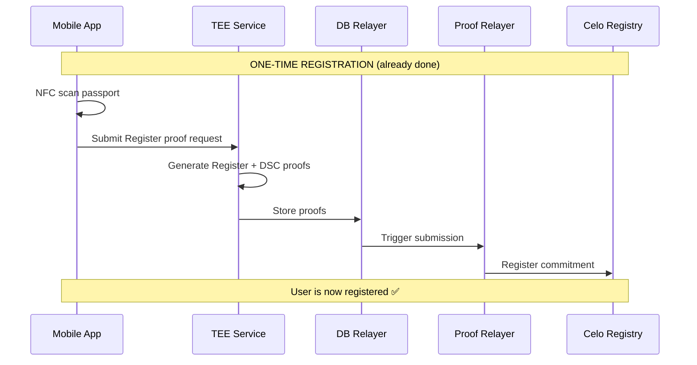
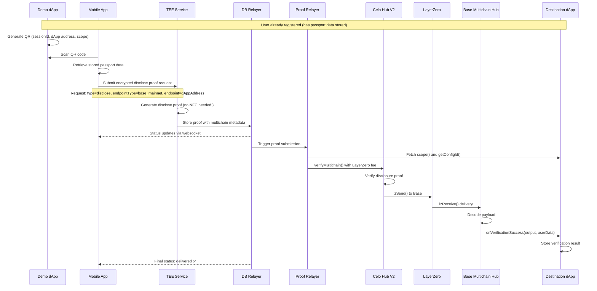

# Full E2E Multichain Testing Plan

## Overview

Implement E2E tests on MAINNET (Celo → Base) for complete multichain verification: Demo app QR → Mobile app → TEE proofs → Relayer → Celo contracts → LayerZero → Base contracts → dApp callback. Uses existing infrastructure from feat/multichain branch with minimal edits.

## Implementation Phases

1. **LayerZero OApp Integration** - Integrate LayerZero OApp into contracts (add lzSend to V2 Hub, lzReceive to Multichain Hub)
2. **Update Relayer ABI** - Update relayer ABI files with verifyMultichain function signature from rebuilt contracts
3. **Complete Relayer** - Complete verify_multichain in relayer (add fee estimation via LayerZero quoteSend, handle transaction submission)
4. **Mainnet Deployment** - Deploy to Celo Mainnet and Base Mainnet (configure LayerZero peers, bridge endpoints, destination hubs)
5. **LayerZero Monitoring** - Implement LayerZero message tracking (monitor MessageSent events, poll LayerZero Scan API, update DB status)
6. **E2E Test Suite** - Create full E2E test (QR generation, mobile flow simulation, proof submission, bridge monitoring, dApp verification)
7. **Demo dApp** - Deploy demo dApp on Base Mainnet with QR generation endpoint and verification tracking

---

## Corrected Architecture

### Prerequisite: User Registration (Already Complete)



### Multichain Disclosure Flow (E2E Test Focus)



---

## Key Findings from feat/multichain Branch

### Registration vs. Disclosure (Important Distinction!)

**Registration** (ONE-TIME, same-chain on Celo):

- User scans passport via NFC
- Generates Register + DSC proofs
- Submits to `IdentityRegistry` on Celo
- Passport data stored locally on mobile app
- User is now "registered" in the system

**Disclosure** (MULTICHAIN, what we're testing):

- User has ALREADY registered (no NFC scan needed!)
- dApp generates QR code with disclosure request
- Mobile app scans QR and uses stored passport data
- Generates disclosure proof (specific fields requested by dApp)
- Proof verified on Celo, output bridged to destination chain
- dApp receives verified attributes on destination chain

### What Already Exists (Minimal edits needed!)

1. **Smart Contracts** (self repo):
   - `verifyMultichain()` function complete in V2 Hub for disclosure proofs
   - Input encoding: `[header:96][destDApp:32][proofData:variable]`
   - `receiveMessage()` in Multichain Hub for destination
   - 60 passing local tests with MockBridge

2. **Relayer Service** (self-infra repo):
   - `verify_multichain()` already implemented (~90% complete)
   - Encodes multichain input correctly for disclosure proofs
   - Fetches scope/configId from dApp
   - Located: `relayer/src/celo/mod.rs`

3. **Database Schema** (self-infra repo):
   - Migration `add_multichain_support.sql` ready
   - Fields: `is_multichain`, `dest_chain_id`, `dest_dapp_address`, `bridge_status`, etc.
   - Located: `db-relayer/migrations/`

4. **Mobile App** (self repo):
   - QR scanning operational
   - Stores passport data after registration
   - Proof history store handles multichain status
   - Located: `app/src/stores/proofHistoryStore.ts:90-92`

### What's Missing (Small gaps!)

1. **LayerZero Integration**: Contracts use MockBridge, need real LayerZero OApp pattern
2. **Relayer ABI**: Needs updated `IIdentityVerificationHubV2.json` with `verifyMultichain`
3. **Fee Estimation**: Relayer needs to call LayerZero `quoteSend()` before submission
4. **Event Monitoring**: Track LayerZero `PacketSent`/`PacketReceived` events
5. **Mainnet Deployment**: Celo Mainnet + Base Mainnet (LayerZero has no testnet support)
6. **E2E Test**: Full flow test with QR code generation

---

## Implementation Plan

### Phase 1: LayerZero OApp Integration in Contracts

**Context**: LayerZero V2 requires contracts to inherit from `OApp` and implement `lzSend`/`lzReceive`.

**Celo Mainnet**:
- Chain ID: 42220
- LayerZero Endpoint ID: 30125
- LayerZero Endpoint: `0xe93685f3bBA03016F02bD1828BaDD6195988D950`

**Base Mainnet**:
- Chain ID: 8453
- LayerZero Endpoint ID: 30184
- LayerZero Endpoint: `0x1a44076050125825900e736c501f859c50fE728c`

#### File: `contracts/contracts/IdentityVerificationHubImplV2.sol`

**Changes**:

1. Add LayerZero dependencies:
   ```bash
   cd contracts
   yarn add @layerzerolabs/oapp-evm @layerzerolabs/lz-evm-protocol-v2
   ```

2. Import OApp:
   ```solidity
   import { OApp, Origin, MessagingFee } from "@layerzerolabs/oapp-evm/contracts/oapp/OApp.sol";
   ```

3. Update contract inheritance:
   ```solidity
   contract IdentityVerificationHubImplV2 is ImplRoot, OApp {
       constructor(address _endpoint) OApp(_endpoint, msg.sender) {
           _disableInitializers();
       }
   }
   ```

4. Replace `_handleBridge()` with LayerZero `lzSend`:
   ```solidity
   function _handleBridge(...) internal {
       // Encode LayerZero payload
       bytes memory lzPayload = abi.encode(destDAppAddress, output, userDataToPass);
   
       // Build options for gas on destination
       bytes memory options = OptionsBuilder
           .newOptions()
           .addExecutorLzReceiveOption(200000, 0); // 200k gas for lzReceive
   
       // Get LayerZero endpoint ID
       uint32 dstEid = $.chainIds[destChainId]; // Store as uint32 not uint16
   
       // Quote fee
       MessagingFee memory fee = _quote(dstEid, lzPayload, options, false);
   
       // Send via LayerZero
       _lzSend(
           dstEid,
           lzPayload,
           options,
           MessagingFee(msg.value, 0),
           payable(msg.sender)
       );
   }
   ```

#### File: `contracts/contracts/IdentityVerificationHubMultichain.sol`

**Changes**:

1. Inherit from `OAppReceiver`:
   ```solidity
   import { OAppReceiver, Origin } from "@layerzerolabs/oapp-evm/contracts/oapp/OAppReceiver.sol";
   
   contract IdentityVerificationHubMultichain is OAppReceiver, ... {
       constructor(address _endpoint) OAppReceiver(_endpoint) {
           _disableInitializers();
       }
   }
   ```

2. Replace `receiveMessage()` with `_lzReceive()`:
   ```solidity
   function _lzReceive(
       Origin calldata _origin,
       bytes32 _guid,
       bytes calldata _message,
       address _executor,
       bytes calldata _extraData
   ) internal override {
       // Decode payload
       (address destDAppAddress, bytes memory output, bytes memory userDataToPass) =
           abi.decode(_message, (address, bytes, bytes));
   
       // Call dApp
       ISelfVerificationRoot(destDAppAddress).onVerificationSuccess(output, userDataToPass);
   
       emit VerificationBridged(...);
   }
   ```

3. Remove old bridge endpoint logic (use LayerZero peers instead)

---

### Phase 2: Complete Relayer Implementation

**File**: `self-infra/relayer/src/celo/mod.rs`

**Current State**: Function exists but needs:
1. Fee estimation via LayerZero
2. Transaction submission with value
3. Error handling

**Add Fee Estimation**:

```rust
// Before calling verifyMultichain, estimate LayerZero fee
let hub_contract = IIdentityVerificationHubV2::new(hub_addr, provider.clone());

// Get LayerZero endpoint to quote fee
let lz_endpoint = ILayerZeroEndpoint::new(LAYERZERO_ENDPOINT_CELO, provider.clone());

// Quote the fee (requires knowing payload size + options)
let fee = lz_endpoint
    .quote_send(dest_lz_chain_id, payload_size, options)
    .call()
    .await?;

// Call verifyMultichain with fee
let tx = hub_contract
    .verifyMultichain(base_verification_input.into(), user_context_data.into())
    .value(fee)
    .send()
    .await?;
```

**Files to Update**:
- `relayer/src/celo/json/IIdentityVerificationHubV2.json` - Rebuild from contracts
- `relayer/src/celo/abi.rs` - Add LayerZero endpoint bindings
- `relayer/src/api/services/transaction.rs` - Wire up multichain endpoint

**New Files**:
- `relayer/src/layerzero/mod.rs` - LayerZero utilities (fee quotes, endpoint IDs)

---

### Phase 3: LayerZero Event Monitoring

**Purpose**: Track bridge status and update database

**File**: `self-infra/relayer/src/layerzero/monitor.rs`

**Implementation**:

```rust
pub async fn monitor_packet_sent(
    session_id: &str,
    tx_hash: &str,
    dest_chain_id: u64,
    db: &Pool<Postgres>
) {
    // 1. Parse PacketSent event from Celo transaction
    let receipt = get_tx_receipt(tx_hash).await?;
    let packet_sent_event = parse_packet_sent_event(receipt)?;

    // 2. Update database with bridge info
    sqlx::query!(
        "UPDATE proofs SET
         bridge_protocol = 'layerzero',
         bridge_status = 'sent',
         bridge_tx_hash = $1,
         bridged_at = NOW()
         WHERE session_id = $2",
        tx_hash, session_id
    ).execute(db).await?;

    // 3. Poll LayerZero Scan for delivery
    let lz_scan_url = format!(
        "https://layerzeroscan.com/api/trx/{}",
        packet_sent_event.guid
    );

    // Poll until delivered (timeout after 10 minutes)
    for _ in 0..120 {
        let response = reqwest::get(&lz_scan_url).await?;
        let status = response.json::<LzScanResponse>().await?;

        if status.delivered {
            // Update DB with destination tx
            sqlx::query!(
                "UPDATE proofs SET
                 bridge_status = 'delivered',
                 dest_tx_hash = $1,
                 delivered_at = NOW()
                 WHERE session_id = $2",
                status.dest_tx_hash, session_id
            ).execute(db).await?;
            break;
        }

        tokio::time::sleep(Duration::from_secs(5)).await;
    }
}
```

**Files to Create**:
- `self-infra/relayer/src/layerzero/monitor.rs`
- `self-infra/relayer/src/layerzero/types.rs` - LzScan API types

**Files to Modify**:
- `self-infra/relayer/src/celo/mod.rs` - Call monitoring after transaction
- `self-infra/db-relayer/src/handlers/db.rs` - Emit status updates to mobile

---

### Phase 4: Mainnet Deployment

**Important**: LayerZero V2 only supports Celo Mainnet (not Alfajores or Sepolia).

**Deployment Flow**:

1. **Deploy Celo Mainnet Contracts**:
   ```bash
   cd contracts
   yarn hardhat run scripts/deploy-mainnet-celo.ts --network celo
   ```
   
   Deploy:
   - IdentityVerificationHubImplV2 (with LayerZero endpoint)
   - IdentityRegistry
   - All verifiers

2. **Deploy Base Mainnet Contracts**:
   ```bash
   yarn hardhat run scripts/deploy-mainnet-base.ts --network base
   ```
   
   Deploy:
   - IdentityVerificationHubMultichain (with LayerZero endpoint)
   - Test dApp contract

3. **Configure LayerZero Peers**:
   ```typescript
   // On Celo Hub V2
   await celoHub.setPeer(
       BASE_LZ_ENDPOINT_ID, // 30184
       ethers.zeroPadValue(baseMultichainHub.address, 32)
   );
   
   // On Base Multichain Hub
   await baseHub.setPeer(
       CELO_LZ_ENDPOINT_ID, // 30125
       ethers.zeroPadValue(celoHub.address, 32)
   );
   ```

4. **Configure Bridge Mappings**:
   ```typescript
   // On Celo Hub V2
   await celoHub.setDestinationHub(
       BASE_CHAIN_ID, // 8453
       ethers.zeroPadValue(baseMultichainHub.address, 32)
   );
   await celoHub.setBridgeChainId(
       BASE_CHAIN_ID, // 8453
       BASE_LZ_ENDPOINT_ID // 30184
   );
   ```

**New Files**:
- `contracts/scripts/deploy-mainnet-celo.ts`
- `contracts/scripts/deploy-mainnet-base.ts`
- `contracts/scripts/configure-layerzero-peers.ts`
- `contracts/deployments/mainnet.json` - Store deployed addresses

**Configuration**:

```json
{
  "celo": {
    "chainId": 42220,
    "lzEndpointId": 30125,
    "lzEndpoint": "0xe93685f3bBA03016F02bD1828BaDD6195988D950",
    "hubV2": "0x...",
    "registry": "0x..."
  },
  "base": {
    "chainId": 8453,
    "lzEndpointId": 30184,
    "lzEndpoint": "0x1a44076050125825900e736c501f859c50fE728c",
    "multichainHub": "0x...",
    "testDApp": "0x..."
  }
}
```

---

### Phase 5: E2E Test Suite with QR Flow

**File**: `self-infra/e2e/multichain.test.ts` (NEW)

**Test Flow**: See full implementation in plan document.

**New Files**:
- `self-infra/e2e/multichain.test.ts` - Full E2E test suite
- `self-infra/e2e/multichain-utils.ts` - Utilities
- `self-infra/e2e/qr-generator.ts` - QR code generation for tests

---

### Phase 6: Demo dApp Deployment

**Purpose**: Simple dApp on Base that accepts verifications and generates QR codes

**File**: `contracts/contracts/test-dapps/TestMultichainDApp.sol` (already exists!)

**Deployment**:

```bash
cd contracts
yarn hardhat run scripts/deploy-test-dapp-base.ts --network base
```

---

## Critical Implementation Details

### LayerZero Peer Configuration

Both contracts MUST set each other as trusted peers:

```solidity
// On Celo Hub
function initialize() {
    // ...
    _setPeer(BASE_LZ_EID, addressToBytes32(baseMultichainHub));
}

// On Base Multichain Hub
function initialize() {
    // ...
    _setPeer(CELO_LZ_EID, addressToBytes32(celoHub));
}
```

### Relayer ABI Update Process

After modifying contracts:

```bash
# 1. Rebuild contracts
cd /Users/evinova/Documents/self/contracts
yarn build

# 2. Copy ABI to relayer
cp artifacts/contracts/IdentityVerificationHubImplV2.sol/IdentityVerificationHubImplV2.json \
   /Users/evinova/Documents/self-infra/relayer/src/celo/json/IIdentityVerificationHubV2.json

# 3. Rebuild relayer bindings
cd /Users/evinova/Documents/self-infra/relayer
cargo build
```

### LayerZero Fee Estimation

The relayer must estimate fees before calling `verifyMultichain()`:

```rust
// In verify_multichain() before calling contract
let options = vec![
    3u8, 0, 0, // Type 3: lzReceive
    0, 3, 13, 136, // 200,000 gas
    0, 0, 0, 0, 0, 0, 0, 0 // No value
];

let messaging_fee = hub_contract
    .quote_send(dest_lz_eid, payload, options, false)
    .call()
    .await?;

let native_fee = messaging_fee.native_fee;
```

---

## Testing Strategy

### Phase Testing

**Phase 1-2: Local** (Already Working)

```bash
cd /Users/evinova/Documents/self/contracts
yarn build
TEST_ENV=local yarn hardhat test test/e2e/multichain-e2e.test.ts
# 60 passing with MockBridge
```

**Phase 3-4: Mainnet Dry Run**

```bash
# Deploy to mainnet
yarn deploy:celo:mainnet
yarn deploy:base:mainnet

# Configure LayerZero peers
yarn configure:layerzero

# Test with $10 worth of gas
```

**Phase 5: Full E2E on Mainnet**

```bash
cd /Users/evinova/Documents/self-infra/e2e
yarn test:mainnet:multichain

# Monitors:
# - Proof generation (30-60s)
# - Celo transaction (10-20s)
# - LayerZero bridge (2-5 min)
# - Base delivery (10s)
# Total: ~4-7 minutes
```

---

## Success Metrics

✅ **Contracts**:
- Both contracts inherit from LayerZero OApp
- Local tests pass with mock
- Deploys to mainnet under 24 KiB limit

✅ **Relayer**:
- Correctly encodes multichain input
- Estimates LayerZero fees
- Submits transactions successfully

✅ **E2E Test**:
- User registration completes on Celo (prerequisite)
- QR code scan → Disclosure proof generation (no NFC!)
- Celo verification → LayerZero bridge → Base delivery
- dApp receives callback with verified attributes
- Full flow completes in under 10 minutes
- All assertions pass

✅ **Production Ready**:
- Monitored on mainnet for 1 week
- No failed transactions
- Average delivery time < 5 minutes

---

## Files to Create/Modify

### New Files (10)

- `contracts/contracts/interfaces/ILayerZeroEndpointV2.sol`
- `contracts/scripts/deploy-mainnet-celo.ts`
- `contracts/scripts/deploy-mainnet-base.ts`
- `contracts/scripts/configure-layerzero-peers.ts`
- `self-infra/relayer/src/layerzero/mod.rs`
- `self-infra/relayer/src/layerzero/monitor.rs`
- `self-infra/e2e/multichain.test.ts`
- `self-infra/e2e/multichain-utils.ts`
- `self-infra/e2e/qr-generator.ts`
- `contracts/deployments/mainnet.json`

### Modified Files (8) - MINIMAL EDITS

- `contracts/contracts/IdentityVerificationHubImplV2.sol` - Add OApp, replace _handleBridge
- `contracts/contracts/IdentityVerificationHubMultichain.sol` - Add OAppReceiver, implement _lzReceive
- `self-infra/relayer/src/celo/mod.rs` - Add fee estimation to verify_multichain
- `self-infra/relayer/src/celo/json/IIdentityVerificationHubV2.json` - Update ABI
- `self-infra/relayer/src/api/services/transaction.rs` - Already has multichain endpoint
- `self-infra/db-relayer/src/handlers/db.rs` - Add bridge status updates
- `contracts/hardhat.config.ts` - Add celo/base mainnet networks
- `self-infra/e2e/constants.ts` - Add mainnet endpoints

**Total**: 18 files (10 new, 8 modified)

---

## Timeline

| Task | Duration | Dependencies |
|------|----------|--------------|
| LayerZero OApp integration | 2-3 days | LayerZero docs, Solidity |
| Update relayer ABI + fees | 1 day | Contracts complete |
| Mainnet deployment | 1 day | Deployment funds |
| LayerZero monitoring | 2 days | LayerZero Scan API |
| E2E test suite | 2-3 days | All above complete |
| Demo dApp + QR | 1 day | Base deployment |

**Total: 9-11 days**


