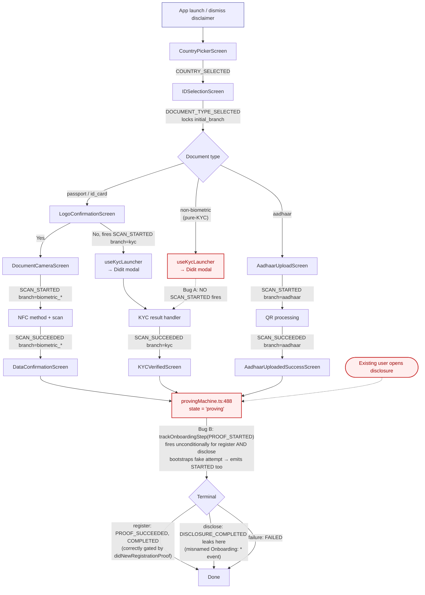
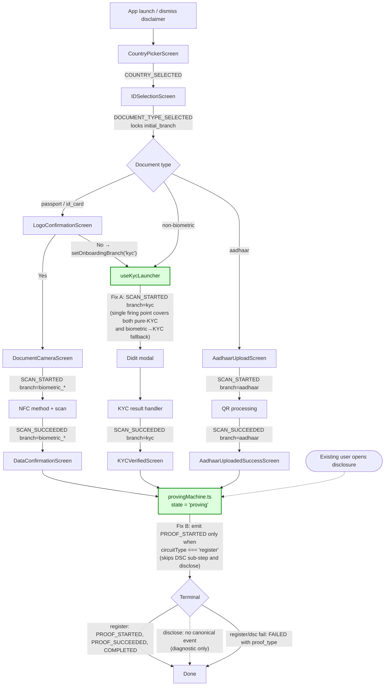
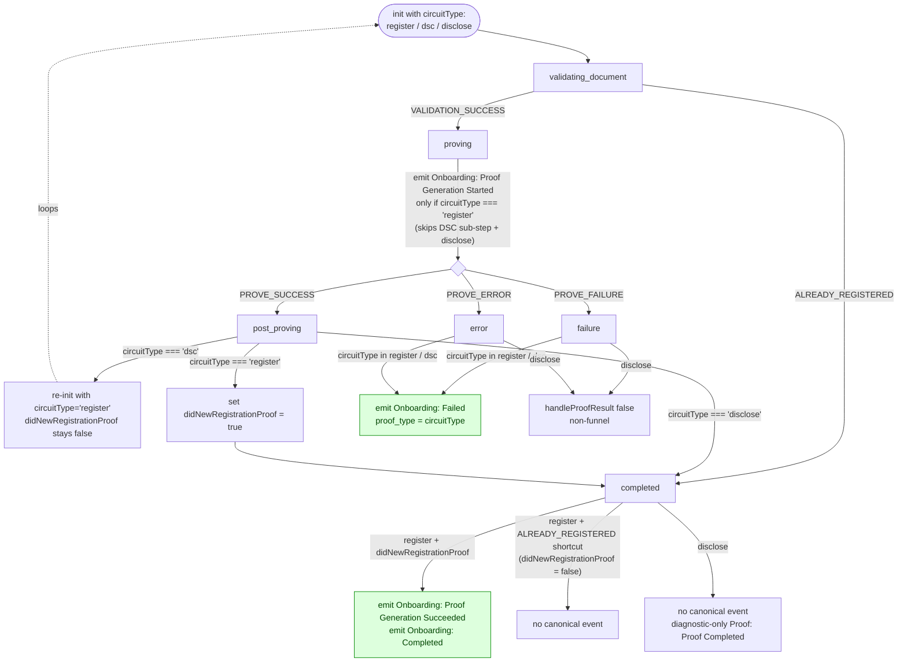

# ANA-11: Canonical Funnel Bug Fixes (Post-ANA-01 Production Findings)

> Last updated: 2026-04-30
> Status: Ready
> Priority: High
> Depends on: ANA-01

- Workstream: analytics
- Backlog ID: ANA-11
- Linear: TBD
- Owner: TBD
- Branch: TBD
- PR: TBD

## Why

After ANA-01 (PR #2000) shipped to production, the Mixpanel dashboard "Canonical Onboarding Funnel — PR #2000" appeared to show that **0% of pure-KYC users complete onboarding**. KYC is in fact converting in production — the data is wrong.

A 7-day analysis of the canonical events identified **two real bugs in the implementation** (the third hypothesis turned out to be expected Mixpanel behavior, see §Non-bug clarification).

### Bug A — Pure-KYC users never fire `Onboarding: Document Scan Started`

ANA-01's Implementation Table specifies that for the KYC branch, `SCAN_STARTED` fires from `LogoConfirmationScreen.tsx:77`'s "No" button handler. That screen is shown only to users who selected a *biometric* document type (passport / id_card) and is the gate that diverts them into the KYC fallback.

A user who selects a non-biometric document type at `IDSelectionScreen` (the "pure-KYC" path — driving licenses, residency cards, etc.) skips `LogoConfirmationScreen` entirely. Their flow goes straight from `DOCUMENT_TYPE_SELECTED` into `useKycLauncher` → Didit modal. There is no `SCAN_STARTED` emission anywhere on this path.

Funnel evidence (7-day window, breakdown by `initial_branch`):

| Step | kyc cohort count |
| --- | --- |
| 1. Started | 333 |
| 2. Country Selected | 333 |
| 3. Document Type Selected | 333 |
| 4. Document Scan Started | **48** |
| 5. Document Scan Succeeded | 3 |
| 6. Proof Generation Started | 0 |

The 333 → 48 step is implausible — the screen sequence for pure-KYC is doc-type → KYC-modal, with no real abandonment surface in between. The 48 are an artifact (probably users who took the biometric path, hit LogoConfirmation "No", and got reclassified into the kyc cohort by Mixpanel's funnel breakdown propagation). The vast majority of pure-KYC users drop out of the funnel at the missing event, not at a real abandonment point.

### Bug B — `PROOF_STARTED` fires too broadly: on disclosures and on the DSC sub-step

ANA-01's terminal-event invariant correctly gates `PROOF_SUCCEEDED` and `COMPLETED` on `circuitType === 'register'`. **`PROOF_STARTED` has no such gate.** It is emitted unconditionally at `provingMachine.ts:488` whenever the proving machine state enters `proving`, including:

1. **Disclosure flows** (`circuitType === 'disclose'`) of already-registered users, which reuse the same proving machine but are not part of the onboarding funnel.
2. **DSC sub-step** (`circuitType === 'dsc'`) for users whose DSC is not yet in the tree. The proving machine enters `proving` first with `circuitType === 'dsc'`, runs the DSC proof, then `postProving` re-inits with `circuitType === 'register'` (provingMachine.ts:1695) and enters `proving` again — but the fire-once guard suppresses the second emission, so `PROOF_STARTED` ends up firing on the DSC step instead of the actual register proof.

For the disclose case, the blast radius is larger than just `PROOF_STARTED`. The emission goes through `trackOnboardingStep`, which calls `ensureAttempt` at `onboardingFunnel.ts:254`. `ensureAttempt` sees no active attempt and **bootstraps a fake one — which itself emits `Onboarding: Started`** as the attempt's first event (`onboardingFunnel.ts:75`). So a single disclosure flow fires *both* `STARTED` and `PROOF_STARTED` against the canonical funnel, neither of which represents an onboarding attempt.

`DISCLOSURE_COMPLETED` is emitted via raw `trackEvent` and does not clear `currentAttempt`. The fake attempt then lingers in module-level state until the next real onboarding either re-uses its `attempt_id` or gets silently no-op'd by the fire-once guard.

For the DSC case, the issue is semantic: `PROOF_STARTED` is meant to mark "the user started their registration proof," not "the user reached the proving phase generically." The DSC sub-step is preparatory plumbing — most users with already-registered DSCs skip it entirely — so attributing the `PROOF_STARTED` milestone to the DSC entry produces inconsistent semantics across cohorts.

Raw event evidence (7-day window):

| Event | Total events | with `initial_branch=pending` |
| --- | --- | --- |
| `Onboarding: Started` | 1867 | **1867 (100%)** |
| `Onboarding: Proof Generation Started` | 838 | 622 |

Every `STARTED` event has `initial_branch=pending` — confirming the implementation correctly emits `'pending'` at attempt creation. But the volume (1867 in 7 days) is substantially higher than the 1577 unique-user starts the funnel reports. The excess and the 622 `pending` PROOF_STARTED events are dominated by disclosure-triggered fake attempts.

## Non-bug clarification — Mixpanel funnel breakdown propagation

A third hypothesis ("`initial_branch` leaks across onboarding attempts") was raised during investigation and turned out to be a misreading of Mixpanel's behavior, not a code bug.

Mixpanel funnel breakdowns by `initial_branch` *propagate* the property value across all steps a user completed in the funnel. So a user whose `initial_branch` becomes `kyc` at step 3 (`DOCUMENT_TYPE_SELECTED`) is counted as "kyc cohort" at steps 1 and 2 retroactively, even though those events physically carry `initial_branch=pending`. This is by design — it lets the dashboard ask "of users who chose KYC, how many reached country selection" — and is not a defect of either the events or the dashboard.

The 1867 / 1867 result above (every `STARTED` event has `initial_branch=pending`) confirms the implementation is correct on this axis. **Do not** add code to "fix" branch state across attempts — there is nothing to fix.

## Current event flow (with bugs)



## Expected event flow (after fixes)



## Proving machine — canonical event firing rules

The proving machine is shared by all three `circuitType`s (`register`, `dsc`, `disclose`). The diagram below shows which canonical onboarding events fire where, and which transitions are no-ops at the funnel layer. The DSC → register loop is the key reason for gating `PROOF_STARTED` on `circuitType === 'register'`: a passport user whose DSC is not yet in the tree enters `proving` twice, and we want the canonical event to mark the second (register) entry, not the first (DSC).



What this enforces:

- **One `PROOF_STARTED` per onboarding attempt**, always at the actual register proof entry — same milestone for users with a registered DSC and users whose DSC needs to be registered first.
- **Disclosure flows never touch the `OnboardingEvents.*` namespace**: no `STARTED` (because `ensureAttempt` is never called from a disclose-path emission), no `PROOF_STARTED`, no `FAILED`, no `COMPLETED`. The only event a disclose flow emits from the proving machine is the diagnostic `Proof: Proof Completed` (with `circuitType: 'disclose'`). Disclosure analytics, when needed, will live in their own namespace — out of scope here.
- **DSC failures are visible** in the `FAILED` event with `proof_type: 'dsc'`. Without this, a user whose DSC step fails would silently disappear at the canonical layer.
- **`ALREADY_REGISTERED` is a no-op** at the canonical layer: the user reached `completed` without proving anything new, so no success event fires. Their attempt simply ends.

## Scope

### In scope

1. **Fix A** — emit `OnboardingEvents.SCAN_STARTED` with `branch: 'kyc'` from `app/src/hooks/useKycLauncher.ts` at the moment the Didit modal is launched. Remove the existing `SCAN_STARTED` emission from `app/src/screens/documents/selection/LogoConfirmationScreen.tsx:77` so the launcher is the single source of truth. The fire-once guard already protects against double emission for biometric → KYC fallback users.

2. **Fix B** — gate the `PROOF_STARTED` emission at `packages/mobile-sdk-alpha/src/proving/provingMachine.ts:488` on `circuitType === 'register'`. This excludes both disclosure flows (no fake `Onboarding: Started` via `ensureAttempt`) and the DSC sub-step (so `PROOF_STARTED` always marks the actual register proof, regardless of whether the user's DSC was already in the tree).

   Pair with: extend the existing `failOnboardingAttempt` calls in the `failure` and `error` state handlers to fire for any non-disclose `circuitType` (i.e. both `register` and `dsc`), and add a `proof_type: get().circuitType` property so dashboards can split DSC vs register failures.

   Also remove `OnboardingEvents.DISCLOSURE_COMPLETED` entirely: delete the constant from `packages/mobile-sdk-alpha/src/constants/analytics.ts` and the emission site in `provingMachine.ts`'s `completed` state handler. Disclosure is not part of onboarding and should not occupy the `Onboarding: *` namespace. Diagnostic completion is already covered by `ProofEvents.PROOF_COMPLETED` (which carries `circuitType` and fires for all three circuit types).

3. **Update ANA-01 spec** to:
   - Change the `SCAN_STARTED` row's "Fire location" cell in §"Canonical Events — Implementation Table": for KYC, replace `LogoConfirmationScreen.tsx "No" fallback path` with `app/src/hooks/useKycLauncher.ts on Didit modal launch (covers pure-KYC entry and biometric→KYC fallback)`.
   - Update the `PROOF_STARTED` row's "Fire location" cell to note the gate is `circuitType === 'register'` (skips DSC sub-step and disclose).
   - Update the `FAILED` row to add `proof_type` (`'register' | 'dsc'`) to its additional properties list, present on proving-stage failures.
   - Remove the `DISCLOSURE_COMPLETED` row from the table; replace the disclosure-completion code snippet with a note that disclose flows fire no canonical event.
   - Add a §"Known issues from v1 production" section pointing readers to ANA-11 with one-line summaries of Bugs A and B and the non-bug clarification about Mixpanel breakdown propagation.

### Out of scope

- You will NOT add new canonical events.
- You will NOT modify the dashboard. Once events are correct, the existing reports will read correctly. The follow-up dashboard re-validation is a manual step in §Validation, not a code deliverable.
- You will NOT backfill historical events.
- You will NOT add a new `DisclosureEvents.*` namespace as part of this fix. Disclosure analytics, if needed, should be designed deliberately under their own workstream.
- You will NOT consolidate the four existing `SCAN_STARTED` emission sites (camera screen, KYC launcher, Aadhaar upload, and the now-deleted LogoConfirmation site). The three remaining sites are different code paths that fire the same event; consolidation is cosmetic.
- You will NOT touch the `LogoConfirmationScreen` "No" handler beyond removing its `SCAN_STARTED` call. The diagnostic event `'App: Logo Confirmation Answered'` and the `setOnboardingBranch('kyc')` call stay as ANA-01 specified.

## Implementation

### Fix A — pure-KYC SCAN_STARTED emission

File: `app/src/hooks/useKycLauncher.ts`

Add an `OnboardingEvents.SCAN_STARTED` emission inside the launcher hook, before `startVerification()` is invoked, with `branch: 'kyc'`:

```ts
import { OnboardingEvents } from '@selfxyz/mobile-sdk-alpha/constants/analytics';
import { trackOnboardingStep } from '@selfxyz/mobile-sdk-alpha/analytics/onboardingFunnel';

// Inside launchKycVerification, before startVerification(...):
trackOnboardingStep(selfClient, OnboardingEvents.SCAN_STARTED, { branch: 'kyc' });
```

(Adjust import paths to whatever the file already uses for SDK imports.)

File: `app/src/screens/documents/selection/LogoConfirmationScreen.tsx:77`

Remove the existing `trackOnboardingStep(selfClient, OnboardingEvents.SCAN_STARTED, { branch: 'kyc' })` call from the "No" button handler. The `setOnboardingBranch('kyc')` call (immediately preceding or following it in the same handler) stays — `current_branch` still needs to flip to `kyc` before the launcher fires its event.

### Fix B — gate PROOF_STARTED on `circuitType === 'register'` and extend FAILED to cover DSC

File: `packages/mobile-sdk-alpha/src/proving/provingMachine.ts`

Tighten the `PROOF_STARTED` emission so it fires only on the actual register proof entry — excluding both the DSC sub-step and disclose flows:

```ts
if (state.value === 'proving' && get().circuitType === 'register') {
  trackOnboardingStep(selfClient, OnboardingEvents.PROOF_STARTED);
}
```

Extend the `failure` and `error` state handlers (current `provingMachine.ts:559` and `:573`) to fire `failOnboardingAttempt` for any non-disclose `circuitType` (i.e. both `'register'` and `'dsc'`), and stamp `proof_type` so DSC vs register failures are distinguishable on the wire:

```ts
} else if (get().circuitType !== null) {
  failOnboardingAttempt(selfClient, 'proof_generation_started', reason ?? error_code ?? 'proof_failure', {
    recoverable: false,
    proof_type: get().circuitType,
  });
}
```

Apply the same change to the `state.value === 'error'` handler (with `recoverable: true`, matching the existing pattern).

### Spec update

File: `specs/projects/sdk/workstreams/analytics/plans/ANA-01-canonical-onboarding-funnel.md`

Apply the three changes listed in §Scope item 3.

## Validation

### Unit tests

- `packages/mobile-sdk-alpha/src/proving/__tests__/provingMachine.analytics.test.ts` — add cases asserting `PROOF_STARTED` does NOT fire when `circuitType === 'disclose'`, AND does NOT fire when `enteredAsRegistration === false` (the `ALREADY_REGISTERED`-from-disclose path that flips `circuitType` to `'register'` mid-flow). Existing positive case (fires on a clean register attempt) stays.
- `app/src/hooks/__tests__/useKycLauncher.test.ts` — add a case asserting `SCAN_STARTED` fires once with `branch: 'kyc'` when the launcher is invoked. If a test file does not already exist for this hook, create one.
- Existing test in `app/src/screens/documents/selection/__tests__/LogoConfirmationScreen.test.tsx` (if present) — remove the assertion that `SCAN_STARTED` fires on the "No" button. Replace with an assertion that `setOnboardingBranch('kyc')` is called.

### Commands

```bash
cd packages/mobile-sdk-alpha && yarn test && yarn types
cd app && yarn test
yarn lint && yarn types
```

### Manual verification

Run the mobile app against the **dev Mixpanel project** (not prod). Run the following four flows in a single app session to validate both fixes interact correctly with the fire-once guard:

1. **Fresh pure-KYC flow** — disclaimer dismiss → country pick → select a non-biometric doc type → KYC modal opens → KYC succeeds → proof generates. Expected events:
   - One `Onboarding: Started` with `initial_branch=pending`.
   - One `Onboarding: Document Scan Started` with `branch=kyc` (Fix A proof — this event is the one currently missing).
   - `SCAN_SUCCEEDED`, `PROOF_STARTED`, `PROOF_SUCCEEDED`, `COMPLETED` all carrying `initial_branch=kyc`, `current_branch=kyc`.

2. **Biometric → KYC fallback flow** — disclaimer dismiss → country pick → passport → LogoConfirmation "No" → KYC modal opens → KYC succeeds → proof generates. Expected events:
   - Exactly one `SCAN_STARTED` total (the biometric one is suppressed because the user never reached `DocumentCameraScreen`; the KYC one fires from `useKycLauncher`). Both pure-KYC and fallback users now hit the launcher; the fire-once guard handles the rest.
   - `initial_branch=biometric_passport`, `current_branch=kyc`, `used_fallback=true` on `COMPLETED`.

3. **Disclosure flow on already-registered user** — open the app to a relying-party request → complete a disclosure proof. Expected:
   - **No** `Onboarding: *` events fire at all (Fix B proof — `Onboarding: Started`, `Onboarding: Proof Generation Started`, and the now-removed `Onboarding: Disclosure Completed` are all absent).
   - The diagnostic `Proof: Proof Completed` event with `circuitType: 'disclose'` still fires.

4. **Already-registered detected mid-register** — start a fresh register attempt against a document that has already been registered (so `ALREADY_REGISTERED` triggers, which mid-flow flips `circuitType` to `'register'` per `provingMachine.ts:1332`). Expected:
   - `enteredAsRegistration === true` so the gate is permissive on `circuitType` flips into `'register'`.
   - But the proving machine does NOT enter `'proving'` state on this path (it short-circuits to `'completed'`), so no `PROOF_STARTED` fires regardless. This case is here to confirm Fix B does not break the existing already-registered handling.

### Re-validation in Mixpanel (post-merge)

Run the `Funnel by initial_branch` report (id 89777075) on the same 7-day window 7 days after merge. Acceptance:
- KYC cohort step 4 (Document Scan Started) conversion is non-trivially > 14% (the buggy baseline). Realistic post-fix: 80–95% (single-button screen).
- KYC cohort step 6 (Proof Generation Started) is non-zero.
- Total `Onboarding: Started` event volume drops measurably (disclosure-triggered fake attempts no longer fire).

If post-merge numbers do not move as expected, the fix is incomplete — re-open this plan rather than declaring done.

## Done Criteria

- Both bugs fixed in code; tests added per §Validation.
- ANA-01 spec updated per §Scope item 3.
- `yarn lint`, `yarn types`, all package test suites pass at repo root.
- Manual verification flows 1–4 pass against the dev Mixpanel project; screenshots attached to PR.
- Post-merge dashboard re-validation (above) shows expected directional movement; results posted as a comment on this plan's Linear issue.

## Notes

- Discovered during dashboard review of "Canonical Onboarding Funnel — PR #2000" on 2026-04-30 (Mixpanel project Self, dashboard id 11144432).
- The same investigation surfaced naming and taxonomy issues with branch-specific events (current `PassportEvents.*` is used for both passport and biometric ID flows; no `KycEvents` group exists). Those are a larger redesign and belong in a separate workstream item (proposed: ANA-12 — branch-specific funnel events), not here.
- Once this lands, ANA-05 (fallback decision events) becomes more valuable because the noise from disclosure pollution is gone; the fallback-offer mini-funnel will read cleanly.
