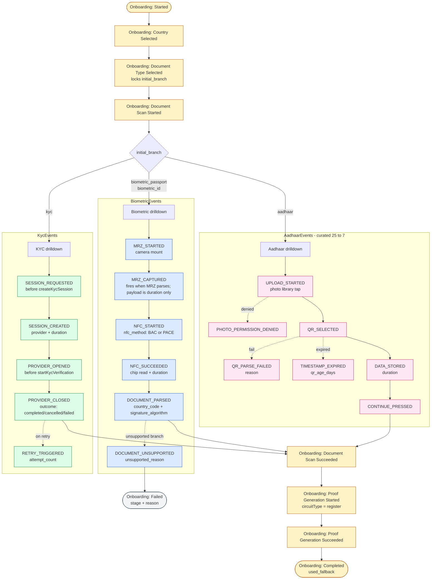

# ANA-12: Branch-Specific Funnel Events (Biometric / KYC / Aadhaar)

> Last updated: 2026-05-15
> Status: In Review
> Priority: High
> Depends on: ANA-01, ANA-11

- Workstream: analytics
- Backlog ID: ANA-12
- Linear: [SELF-2870](https://linear.app/selfprotocol/issue/SELF-2870/ana-12-branch-specific-funnel-events-biometric-kyc-aadhaar)
- Owner: Remi Colin
- Branch: `feat/ana-12-branch-events`
- PR: [#2054](https://github.com/selfxyz/self/pull/2054)

## Why

The canonical onboarding funnel from ANA-01 collapses each branch's "scan" step into one `SCAN_STARTED` → `SCAN_SUCCEEDED` pair. That works for the cross-branch question ("did the user complete onboarding?") but is useless for the per-branch question ("where in the biometric flow do users actually fail?"). Three branches with three completely different scanning mechanics share the same canonical event:

- **Biometric** (passport + biometric ID): camera permission → MRZ capture → NFC handshake → NFC chip read → DSC validation → document support check
- **KYC** (third-party provider): session create → modal open → provider returns success/cancel/fail
- **Aadhaar**: photo library permission → QR upload → QR parse → timestamp validation → data storage

Today's drop-off between `SCAN_STARTED` and `SCAN_SUCCEEDED` for biometric users is 84% (production data, 7-day window). We have no way to tell whether they couldn't get the camera up, couldn't read the MRZ, couldn't NFC, or hit an unsupported document. The CTO question for unsupported-document prioritization (which DSC algos to add next) needs a property-tagged failure event we don't currently emit.

The naming layer is also broken: `PassportEvents.*` is used for both passport AND biometric ID (same code path), there's no `KycEvents` group at all, and `AadhaarEvents.*` has 25 events most of which are operational noise.

## Flow

The canonical funnel collapses scanning into a single `SCAN_STARTED → SCAN_SUCCEEDED` step. ANA-12 layers a branch-specific funnel underneath each canonical step, joined back via `attempt_id`.



Every branch event is stamped with `attempt_id` / `initial_branch` / `current_branch` by `trackBranchEvent`, which **no-ops if there is no active onboarding attempt** (avoids the disclosure-pollution class of bug ANA-11 fixed). Branch events do not dedupe — multiple OCR retries before a successful MRZ legitimately fire `MRZ_STARTED` more than once.

## Scope

### In scope

1. **Rename `PassportEvents` → `BiometricEvents`** in `packages/mobile-sdk-alpha/src/constants/analytics.ts`. Cover both passport and biometric ID via a `document_type` property, not separate event groups. Migrate all call sites.
2. **Create `KycEvents`** as a new constant group covering the KYC provider boundary events.
3. **Curate `AadhaarEvents`** down from ~25 events to ~7 funnel-relevant events. Move the rest to Sentry breadcrumbs (handled in ANA-13; for ANA-12 just delete the Mixpanel emissions).
4. **Define exactly 5–7 milestone events per branch** with the format `<Flow>: <Stage> <Outcome>`. Every event carries `attempt_id` (joinable with canonical events) plus branch-specific properties.
5. **Build three branch dashboards** in Mixpanel — one per branch. Each is the canonical funnel filtered to that branch + the branch drilldown events stitched in.

### Out of scope

- You will NOT add Sentry breadcrumbs in this spec — ANA-13 handles the diagnostic-layer migration. Here you only delete Mixpanel emissions for diagnostic events (the breadcrumbs come later).
- You will NOT instrument the KYC provider's interior (selfie, liveness, doc capture). Those are black-box sub-steps. KYC drilldown stops at the boundary.
- You will NOT add new canonical `OnboardingEvents.*`. Branch events live in their own namespaces.
- You will NOT change the canonical funnel dashboard. It stays as-is, sourced only from canonical events.
- You will NOT instrument the WebView surface. WebView observability is a separate workstream.

## Naming convention

| Pattern | Example | Notes |
| --- | --- | --- |
| Constant group | `BiometricEvents`, `KycEvents`, `AadhaarEvents` | Mirror the canonical `OnboardingEvents` group format |
| Event name | `'Biometric: MRZ Captured'` | `<Flow>: <Noun> <PastVerb>` — one noun, one verb. Use the domain verb when it's natural (`Captured`, `Parsed`, `Stored`, `Created`); fall back to `Started` / `Succeeded` / `Failed` / `Cancelled` when no clean domain verb exists. **Never double up**: `MRZ Started` not `MRZ Capture Started`; `MRZ Restarted` not `MRZ Capture Restarted`. The noun already implies the action. |
| Mandatory properties | `attempt_id`, `initial_branch`, `current_branch` | Same triple as canonical events. Stamp via a small shared helper, not hand-written per call site |

### Event helper

Add `trackBranchEvent(selfClient, eventName, properties)` to `packages/mobile-sdk-alpha/src/analytics/onboardingFunnel.ts` alongside `trackOnboardingStep`. It MUST:

- Read `attempt_id`, `initial_branch`, `current_branch` from the active onboarding attempt and stamp them on every emitted event.
- NOT bootstrap a fake attempt if `currentAttempt` is null (unlike `trackOnboardingStep`). Branch events fire only inside an active onboarding attempt; if there's no attempt, they no-op silently. This prevents the same disclosure-pollution class of bug ANA-11 fixed for `PROOF_STARTED`.
- NOT dedupe (no fire-once guard). Branch events can legitimately fire multiple times per attempt (e.g. multiple OCR retries before a successful MRZ).

### Payload invariant — no PII

Branch event payloads carry **categorical, operational, and timing properties only**. Never fire raw document fields, raw user input, raw provider responses, or anything that identifies a person.

- Allowed: enum-style categories (`document_type`, `outcome`, `unsupported_reason`, `nfc_method`), operational identifiers (`provider`, `signature_algorithm`, `csca_hash_algorithm`), aggregate metrics (`duration_seconds`, `qr_age_days`, `attempt_count`), error codes from typed error enums.
- Allowed but treat as quasi-identifiers: `country_code`. Already present on the canonical funnel (`Onboarding: Country Selected`), so per-event stamping on `DOCUMENT_PARSED` / `DOCUMENT_UNSUPPORTED` is not new exposure and is needed for the (country × signature_algorithm) DSC-prioritization view.
- Forbidden: MRZ contents, document number, name, DOB, expiry, nationality string, photo bytes, Aadhaar QR payload, KYC selfie/liveness frames, provider-returned PII, sanitized-but-readable error messages that include any of the above.

If a new event would help product but requires a forbidden field, the answer is a Sentry breadcrumb (ANA-13), not a new Mixpanel event. Tests that snapshot event strings should also assert the property whitelist for that event.

## Branch event tables

### Biometric (passport + biometric ID)

| Constant | Event name | Fire site | Additional properties |
| --- | --- | --- | --- |
| `BiometricEvents.MRZ_STARTED` | `Biometric: MRZ Started` | `app/src/screens/documents/scanning/DocumentCameraScreen.tsx` on camera mount | `document_type` |
| `BiometricEvents.MRZ_CAPTURED` | `Biometric: MRZ Captured` | `useReadMRZ` success callback, when the camera returns a parseable MRZ. The MRZ contents themselves are NEVER fired — `document_type` is the document category enum, `duration_seconds` is wall-clock from camera mount. | `document_type`, `duration_seconds` |
| `BiometricEvents.NFC_STARTED` | `Biometric: NFC Started` | `DocumentNFCScanScreen.tsx` on NFC begin | `document_type`, `nfc_method` (`'BAC' \| 'PACE'`) |
| `BiometricEvents.NFC_SUCCEEDED` | `Biometric: NFC Succeeded` | Same screen on chip read complete | `document_type`, `duration_seconds` |
| `BiometricEvents.DOCUMENT_PARSED` | `Biometric: Document Parsed` | `provingMachine.ts` `validating_document` state on successful parse | `document_type`, `country_code`, `signature_algorithm`, `csca_hash_algorithm` |
| `BiometricEvents.DOCUMENT_UNSUPPORTED` | `Biometric: Document Unsupported` | `provingMachine.ts` when `checkDocumentSupported` returns non-supported | `document_type`, `country_code`, `signature_algorithm`, `unsupported_reason` (`'unknown_dsc' \| 'unsupported_algo' \| 'country_not_in_list'`) |

The signature-algorithm and country properties on `DOCUMENT_PARSED` and `DOCUMENT_UNSUPPORTED` are the actual product-prioritization signal — the dashboard query "top 10 (country, sig_algo) combinations failing the support check" tells the team which DSCs to add next.

### KYC

| Constant | Event name | Fire site | Additional properties |
| --- | --- | --- | --- |
| `KycEvents.SESSION_REQUESTED` | `Kyc: Session Requested` | `app/src/hooks/useKycLauncher.ts` immediately before `createKycSession` | `provider` (provider id string) |
| `KycEvents.SESSION_CREATED` | `Kyc: Session Created` | Same hook, after `createKycSession` resolves | `provider`, `duration_seconds` |
| `KycEvents.PROVIDER_OPENED` | `Kyc: Provider Opened` | Immediately before `startKycVerification` | `provider` |
| `KycEvents.PROVIDER_CLOSED` | `Kyc: Provider Closed` | Same hook, single event for all three provider terminal `type`s | `provider`, `outcome` (`'completed' \| 'cancelled' \| 'failed'`), `error_code` (when `outcome === 'failed'`), `duration_seconds` |
| `KycEvents.RETRY_TRIGGERED` | `Kyc: Retry Triggered` | `KycFailureScreen.tsx` retry button | `provider`, `attempt_count` (sourced from `incrementAttemptRetryCount('kyc')` — counter lives on the funnel attempt, NOT a `useRef` on the screen, since the screen unmounts on navigation) |

`provider` is stamped from day one with the configured KYC provider id so we can A/B different providers later without renaming events.

### Aadhaar

Curate the existing 25-event `AadhaarEvents` group down to 7. **Delete the rest** from Mixpanel emission (their useful counterparts move to Sentry breadcrumbs in ANA-13).

| Constant | Event name | Fire site | Additional properties |
| --- | --- | --- | --- |
| `AadhaarEvents.UPLOAD_STARTED` | `Aadhaar: Upload Started` | `app/src/screens/documents/aadhaar/AadhaarUploadScreen.tsx` on photo library tap | — |
| `AadhaarEvents.PHOTO_PERMISSION_DENIED` | `Aadhaar: Photo Permission Denied` | Same screen when permission denied | — |
| `AadhaarEvents.QR_SELECTED` | `Aadhaar: QR Selected` | After photo picker returns image | — |
| `AadhaarEvents.QR_PARSE_FAILED` | `Aadhaar: QR Parse Failed` | Replace `QR_CODE_PARSE_FAILED` + `QR_CODE_INVALID_FORMAT` + `QR_CODE_MISSING_FIELDS` | `reason` (`'parse_error' \| 'invalid_format' \| 'missing_fields'`) |
| `AadhaarEvents.TIMESTAMP_EXPIRED` | `Aadhaar: Timestamp Expired` | Replace `TIMESTAMP_VALIDATION_FAILED` | `qr_age_days` |
| `AadhaarEvents.DATA_STORED` | `Aadhaar: Data Stored` | After successful storage | `duration_seconds` |
| `AadhaarEvents.CONTINUE_PRESSED` | `Aadhaar: Continue Pressed` | `AadhaarUploadedSuccessScreen.tsx` continue button | — |

Events to **delete from Mixpanel emission** in this PR: `UPLOAD_SCREEN_OPENED`, `UPLOAD_BUTTON_ENABLED`, `UPLOAD_BUTTON_DISABLED`, `PHOTO_LIBRARY_UNAVAILABLE`, `PROCESSING_STARTED`, `QR_DATA_EXTRACTION_STARTED`, `QR_DATA_EXTRACTION_SUCCESS`, `TIMESTAMP_VALIDATION_STARTED`, `TIMESTAMP_VALIDATION_SUCCESS`, `DATA_STORAGE_STARTED`, `DATA_STORAGE_SUCCESS`, `QR_UPLOAD_REQUESTED`, `QR_UPLOAD_SUCCESS`, `QR_UPLOAD_FAILED`, `ERROR_SCREEN_NAVIGATED`, `RETRY_BUTTON_PRESSED`, `PERMISSION_MODAL_OPENED`, `PERMISSION_MODAL_DISMISSED`, `PERMISSION_SETTINGS_OPENED`, `HELP_BUTTON_PRESSED`, `USER_CANCELLED_SELECTION`, `QR_CODE_PARSE_FAILED`, `QR_CODE_INVALID_FORMAT`, `QR_CODE_MISSING_FIELDS`, `TIMESTAMP_VALIDATION_FAILED`. Their constants stay in `analytics.ts` only if ANA-13 needs them as breadcrumb categories; otherwise delete the constants too.

## Implementation

### Step 1 — rename `PassportEvents` → `BiometricEvents`

File: `packages/mobile-sdk-alpha/src/constants/analytics.ts`

Replace the `PassportEvents` export with a new `BiometricEvents` export covering the same set of events (renamed where appropriate to use the `Biometric:` prefix and the new milestone names from the table above). Keep a temporary `PassportEvents` re-export aliased to `BiometricEvents` for one release to avoid a coordinated rename — drop it in the next minor.

Update all call sites in `app/src/` and `packages/mobile-sdk-alpha/src/` to import `BiometricEvents`. Search-and-replace is safe because the constants are only referenced by name.

### Step 2 — create `KycEvents` and emission sites

File: `packages/mobile-sdk-alpha/src/constants/analytics.ts` — add the `KycEvents` group.

Wire emission sites in `app/src/hooks/useKycLauncher.ts`:

- Before `createKycSession` → `SESSION_REQUESTED`
- After `createKycSession` resolves → `SESSION_CREATED` with `duration_seconds`
- Before `startKycVerification` → `PROVIDER_OPENED`
- After `startKycVerification` resolves (any of the three result types) → `PROVIDER_CLOSED` with `outcome`

Wire `RETRY_TRIGGERED` in `KycFailureScreen.tsx` retry button handler.

`LogoConfirmationScreen.tsx` direct path (the one not using the hook) gets the same emission additions inline. Note that `setOnboardingBranch('kyc')` MUST fire before any KYC branch event so `current_branch` is already `'kyc'` when `SESSION_REQUESTED` / `SESSION_CREATED` are stamped — otherwise those two events ship with the stale biometric branch. Consolidating onto `useKycLauncher` is a separate follow-up.

### Step 3 — curate `AadhaarEvents`

File: `packages/mobile-sdk-alpha/src/constants/analytics.ts`

Delete the 25 obsolete constants listed above. Add the 7 new ones. Update emission sites in `app/src/screens/documents/aadhaar/`.

For `QR_PARSE_FAILED`, the existing parser already differentiates the three failure modes — collapse them into one event with a `reason` property at the call site.

### Step 4 — biometric event emissions

Wire `MRZ_STARTED` (on camera mount) and `MRZ_CAPTURED` (when `useReadMRZ` returns a parseable MRZ) in `app/src/screens/documents/scanning/DocumentCameraScreen.tsx` / `read-mrz.ts`.
Wire `NFC_STARTED` and `NFC_SUCCEEDED` in `DocumentNFCScanScreen.tsx`.
Wire `DOCUMENT_PARSED` in `provingMachine.ts` immediately after the existing `PassportEvents.PASSPORT_PARSED` emission, with the parsed metadata properties.
Wire `DOCUMENT_UNSUPPORTED` in `provingMachine.ts:1343` (the `isSupported.status !== 'passport_supported'` branch). Map `isSupported.status` to the `unsupported_reason` enum. The existing `PassportEvents.COMING_SOON` emission stays as a temporary diagnostic — ANA-13 removes it.

### Step 5 — `trackBranchEvent` helper

File: `packages/mobile-sdk-alpha/src/analytics/onboardingFunnel.ts`

Add at the bottom:

```ts
export function trackBranchEvent(
  selfClient: Pick<SelfClient, 'trackEvent'>,
  event: string,
  properties?: Record<string, unknown>,
): void {
  if (!currentAttempt) return;
  selfClient.trackEvent(event, {
    ...baseProperties(currentAttempt),
    ...properties,
  });
}
```

All branch event emissions go through this helper, never raw `selfClient.trackEvent`. This keeps the `attempt_id` / `initial_branch` / `current_branch` stamping in one place.

### Step 6 — dashboards

After events are live in production for 24 hours and verified in the dev Mixpanel project, build three new dashboards in Mixpanel:

- **Biometric Funnel**: canonical funnel filtered to `initial_branch in (biometric_passport, biometric_id)`, plus a sequential funnel of `MRZ_STARTED → MRZ_CAPTURED → NFC_STARTED → NFC_SUCCEEDED → DOCUMENT_PARSED`. Side panel: top 10 `(country_code, signature_algorithm)` combinations from `DOCUMENT_UNSUPPORTED`.
- **KYC Funnel**: canonical funnel filtered to `initial_branch = 'kyc'`, plus a sequential funnel of `SESSION_REQUESTED → SESSION_CREATED → PROVIDER_OPENED → PROVIDER_CLOSED (outcome=completed)`. Side panel: outcome breakdown of `PROVIDER_CLOSED`.
- **Aadhaar Funnel**: canonical funnel filtered to `initial_branch = 'aadhaar'`, plus the 7-step Aadhaar drilldown.

Dashboard build is *part* of this PR (docs + screenshots). The dashboards themselves are constructed in the dev Mixpanel project and migrated to prod with the merge.

## Validation

### Unit tests

- `packages/mobile-sdk-alpha/tests/analytics/onboardingFunnel.test.ts` — add cases for `trackBranchEvent`: stamps `attempt_id` correctly, no-ops when no attempt, does NOT bootstrap an attempt.
- `packages/mobile-sdk-alpha/tests/analytics/branchEvents.test.ts` (new) — assert each branch event constant matches the spec'd string.

### Commands

```bash
cd packages/mobile-sdk-alpha && yarn test && yarn types
cd app && yarn test && yarn types
yarn lint
```

### Manual verification

For each branch, run a full happy-path attempt and verify in dev Mixpanel:

- Biometric: every event in the table fires once, in order, with correct properties. Specifically `DOCUMENT_PARSED` has non-empty `signature_algorithm` and `country_code`.
- KYC: 4 sequential events (`SESSION_REQUESTED → SESSION_CREATED → PROVIDER_OPENED → PROVIDER_CLOSED`), `PROVIDER_CLOSED.outcome === 'completed'`.
- Aadhaar: 5 sequential events (`UPLOAD_STARTED → QR_SELECTED → DATA_STORED → CONTINUE_PRESSED`); none of the deleted events appear in the event stream.

Run a forced unsupported-document scenario and verify `DOCUMENT_UNSUPPORTED` fires with a populated `unsupported_reason`.

Run a disclosure flow on the same device immediately after — verify NO branch events fire (the helper no-ops because no active attempt).

## Done Criteria

- All branch event constants and emission sites in place per the tables.
- `trackBranchEvent` helper added with unit tests.
- All 25 obsolete `AadhaarEvents` constants deleted, replaced with 7 curated ones.
- `PassportEvents` renamed to `BiometricEvents` with a deprecation alias.
- Three Mixpanel dashboards built in the dev project; screenshots in PR description.
- `yarn lint`, `yarn types`, all tests pass at repo root.
- Linear issue updated via comment with PR link.

## Notes

- `BiometricEvents` and `AadhaarEvents` curation in this PR is the Mixpanel side only. The sub-step events that get deleted from Mixpanel here become Sentry breadcrumbs in ANA-13. The two PRs should land within one release of each other so there's no observability gap.
- The `PassportEvents → BiometricEvents` rename is a soft deprecation. The alias should disappear by the second release after this lands; track that as a follow-up.
- `KycEvents` is provider-tagged from day one. If we add Veriff or Sumsub later, the same events fire with `provider: 'veriff'` and dashboards split cleanly.
