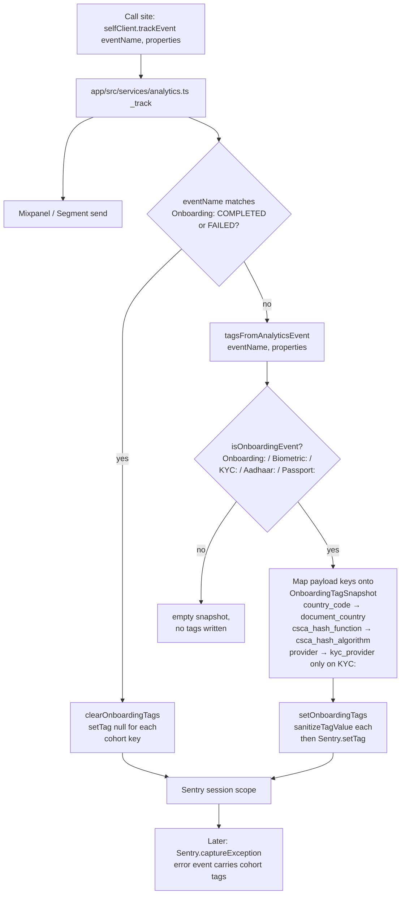

# ANA-13: Observability Migration — Mixpanel Diet, Sentry Breadcrumbs, Session Replay

> Last updated: 2026-05-06
> Status: Ready
> Priority: High
> Depends on: ANA-01, ANA-11, ANA-12

- Workstream: analytics
- Backlog ID: ANA-13
- Linear: TBD
- Owner: TBD
- Branch: TBD
- PR: TBD

## Why

The Self mobile app currently fires ~200 distinct events into Mixpanel (via Segment). After ANA-01 + ANA-11 + ANA-12 land, only ~30 of those events are consumed by a dashboard, alert, or product question. The remaining ~170 are operational noise: socket lifecycle, NFC handshake sub-steps, parser internals, retry plumbing. They cost real money (Mixpanel bills per event), pollute the analytics workspace, and — critically — provide a _worse_ debugging experience than purpose-built observability tools would.

The migration framework: **each event needs one named consumer.** If you can't say "this event drives the X dashboard" or "this event answers the Y product question," the event doesn't belong in Mixpanel. It belongs in Sentry breadcrumbs (free until an error occurs) or Sentry Session Replay (visual session reconstruction with cohort filtering by tags).

Sentry is already configured (`@sentry/react-native@7.0.0`) with `mobileReplayIntegration` and a `logProofEvent` → breadcrumb pipeline already wired through `selfClient.logProofEvent` in the SDK and `selfClientProvider.tsx:286-289` in the app. Most of the migration is _moving emissions from `selfClient.trackEvent` to `selfClient.logProofEvent`_, not setting up new infrastructure.

## Goals

1. **Cut Mixpanel event volume by ~80%** — from ~200 events to ~30, all with named consumers.
2. **Migrate diagnostic events to Sentry breadcrumbs** so error captures and Session Replays carry full forensic context.
3. **Tag every Sentry session with cohort properties** (`document_country`, `document_type`, `signature_algorithm`, `initial_branch`, `attempt_id`, etc.) so engineers can filter "show me all errors and replays for German passport users with RSA-PSS sig algos."
4. **Tighten Session Replay PII masking** — current config is `maskAllText: true` which is a good baseline, but biometric data (passport photos, MRZ contents in input fields, NFC chip dumps) needs an explicit allow/block list review.
5. **Establish a hard cap on Mixpanel events** going forward — every new Mixpanel event requires a documented consumer in the PR description.

## Non-goals

- You will NOT instrument the WebView surface in this PR. WebView lacks Sentry today; that's a separate workstream.
- You will NOT migrate native-side (iOS/Android/KMP) events. Native NFC events going to Mixpanel via `PassportReader` stay as-is for now (ANA-04 territory).
- You will NOT add Datadog or any other observability vendor. Sentry covers errors + replay + breadcrumbs; that's enough.
- You will NOT change the canonical `OnboardingEvents` set. Those are funnel-driving and stay in Mixpanel.
- You will NOT change ANA-12's branch-specific events (`BiometricEvents`, `KycEvents`, `AadhaarEvents`). Those have named dashboards and stay in Mixpanel.
- You will NOT add abandonment events, super-property enrichment, or A/B test tagging. Those are ANA-08 / ANA-06 / ANA-09.
- You will NOT integrate Sentry Performance / Tracing in this PR beyond what's already configured.

## What stays in Mixpanel (the keep list)

After this lands, exactly these event groups remain in Mixpanel:

| Group                | Count        | Why kept                                                                                                  |
| -------------------- | ------------ | --------------------------------------------------------------------------------------------------------- |
| `OnboardingEvents`   | 10           | Canonical funnel — drives all top-level conversion dashboards. ANA-01.                                    |
| `BiometricEvents`    | 6            | Branch funnel + DSC prioritization signal. ANA-12.                                                        |
| `KycEvents`          | 5            | Branch funnel. ANA-12.                                                                                    |
| `AadhaarEvents`      | 7            | Branch funnel. ANA-12 (curated from 25).                                                                  |
| `AppEvents`          | ~6           | High-level app lifecycle (privacy disclaimer, get-started, update modals). Drives acquisition dashboards. |
| `BackupEvents`       | ~14          | Cloud backup conversion is its own funnel. Keep as-is for now; revisit if a separate spec curates them.   |
| `PointEvents`        | ~13          | Rewards/referral funnel — distinct product surface. Keep.                                                 |
| `NotificationEvents` | 2            | Push-notification engagement metric. Keep.                                                                |
| `AuthEvents`         | ~3 (curated) | Login success/failure funnel. Curate from 8 → 3 in this PR (success / failure / biometric_login_failed).  |

Total target: ~66 events. Everything else moves to breadcrumbs or gets deleted.

## What moves to Sentry breadcrumbs (the migrate list)

The bulk of `ProofEvents` (~43 events) and the deleted `AadhaarEvents` (~18 events) become breadcrumbs. Examples:

| Currently emits                                                           | Becomes                                                                                         |
| ------------------------------------------------------------------------- | ----------------------------------------------------------------------------------------------- |
| `ProofEvents.SOCKETIO_CONN_STARTED` (Mixpanel)                            | `Sentry.addBreadcrumb({ category: 'proof.socket', message: 'connect started', level: 'info' })` |
| `ProofEvents.NFC_RESPONSE_PARSE_FAILED` (Mixpanel)                        | breadcrumb with `level: 'warning'`, `category: 'proof.nfc'`, `data: { error_code }`             |
| `ProofEvents.PAYLOAD_GEN_STARTED` (Mixpanel)                              | breadcrumb with `category: 'proof.payload'`                                                     |
| `AadhaarEvents.QR_DATA_EXTRACTION_STARTED` (Mixpanel — deleted in ANA-12) | breadcrumb with `category: 'aadhaar.qr'`                                                        |

Rule of thumb: **plumbing events become breadcrumbs; outcome events stay in Mixpanel.**

## What gets deleted outright

Events that are neither funnel inputs nor useful debugging context. Per-mock-parameter `MockDataEvents` (12 events) — they describe internal dev tooling, not user behavior. Most of `SettingsEvents` (3 events) — modal open/close clicks aren't a product question. Subset of `AuthEvents` like `BIOMETRIC_LOGIN_ATTEMPT` (we have success and failure, attempt is implied). Inventory the full delete list during implementation; flag in PR description.

## Sentry tag taxonomy (the cohort layer)

Add the following Sentry tags via the existing whitelist (`app/src/config/sentry.ts:28-40`). They power "filter all sessions by German passport with RSA-PSS algo" queries:

| Tag                   | Set when                                       | Cleared when            | Source                                     |
| --------------------- | ---------------------------------------------- | ----------------------- | ------------------------------------------ |
| `attempt_id`          | Onboarding attempt starts (in `ensureAttempt`) | Attempt completes/fails | `currentAttempt.id`                        |
| `initial_branch`      | Locked at `DOCUMENT_TYPE_SELECTED`             | Attempt ends            | `currentAttempt.initialBranch`             |
| `current_branch`      | Updated on every branch change                 | Attempt ends            | `currentAttempt.currentBranch`             |
| `document_country`    | After country-picker confirm                   | Attempt ends            | `country_code`                             |
| `document_type`       | After ID-selection confirm                     | Attempt ends            | Already whitelisted                        |
| `signature_algorithm` | After `passport_parsed` (biometric only)       | Attempt ends            | From `passportData.dg1_hash_function` etc. |
| `csca_hash_algorithm` | Same                                           | Attempt ends            | From `passportData.csca_hash_function`     |
| `kyc_provider`        | At KYC session start                           | Attempt ends            | configured provider id                     |
| `app_build_channel`   | App startup                                    | Never (super-tag)       | Out of scope here — flagged for ANA-02     |

All tags are session-scoped via `Sentry.setTag` inside a scope. Tag setting is centralized in a new `app/src/observability/onboardingContext.ts` module (or extension to `app/src/config/sentry.ts`); call sites do not call `Sentry.setTag` directly.

Sanitization: all tag values pass through the existing `sanitizeTagValue` (alphanumeric + underscores, 200 char limit). No raw IDs or user names ever land in tags.

### Cohort-tag flow



The mapping layer is the single place property names cross the analytics/Sentry boundary, so a typo in one event payload cannot quietly pollute every session's tags. Non-string values are silently skipped; partial snapshots never blow away previously-set tags (empty/`undefined`/`null` are no-ops, not clears).

## Session Replay configuration

Current state: `mobileReplayIntegration` is enabled with `maskAllText: true`, `maskAllImages: false`, `maskAllVectors: false`. Sample rate 10% session / 100% on error.

Required changes for biometric safety:

1. **`maskAllImages: true`** — passport photos absolutely must not be in replays. Default false is unsafe for this app.
2. **`maskAllVectors: true`** — defensive. SVG content can leak details.
3. **Block-list specific screens entirely**: `DocumentCameraScreen`, `DocumentNFCScanScreen`, `DataConfirmationScreen`, `AadhaarUploadScreen`, `KYCVerifiedScreen`. Any screen that displays MRZ, NFC chip data, name/DOB, or passport photos. Use `Sentry.ReactNativeTracing` or per-component `<Mask>` wrappers; configure in the screen files themselves.
4. **`beforeSend` extension**: scan `event.contexts.replay` data and reject any breadcrumb whose `data` contains a key matching `/passport|mrz|dg\d|chip|aadhaar|name|dob|birth|photo/i`. Belt-and-suspenders against accidental field leaks.

After tightening, confirm sample rates remain 10%/100%; cost impact on Sentry is minimal because most onboarding sessions don't error.

## Implementation phases

This is too big for one PR. Phase it:

### Phase 1 — instrument breadcrumbs (additive, no deletions)

PR 1. Add `Sentry.addBreadcrumb` calls alongside (not replacing) every diagnostic `selfClient.trackEvent` in the migrate list. Add the Sentry tags via a centralized `setOnboardingTags(attempt)` helper called from `trackOnboardingStep` and `trackBranchEvent`. Wire Session Replay masking changes (block-list screens, tighten image/vector masking). No Mixpanel events are removed in this PR.

Validation: capture an intentional error during onboarding in the dev Sentry project. Verify the error's breadcrumbs contain the expected diagnostic trail with the new categories. Verify the error's tags include `attempt_id`, `initial_branch`, `document_country`, etc. Verify Session Replays mask the listed screens.

### Phase 2 — delete Mixpanel diagnostic emissions

PR 2 (after Phase 1 has run in production for one full release cycle). Remove the `selfClient.trackEvent` calls for events on the migrate and delete lists. Delete unused constants from `analytics.ts`. Update the analytics service to emit a console warning when an unrecognized event name is passed (catches stragglers).

Validation: 7-day Mixpanel volume comparison — total event count should drop ~80%. The canonical and branch dashboards still work identically.

### Phase 3 — enforce the cap

PR 3 (smaller). Add a typed `KnownEventName` union covering only the kept events; have `selfClient.trackEvent` accept only that union. New Mixpanel events require updating the union and a corresponding line item in this spec's "keep list" table. Lints / types fail the CI if someone tries to `trackEvent('Some New Thing')` without registering it.

Each phase ships as its own PR (per CLAUDE.md PR-size rules).

## Privacy review

Before Phase 1 ships, do a privacy review pass:

- Confirm with legal that Session Replay (10% session sample) is acceptable given current ToS / privacy policy. If not, add a user-facing toggle in settings.
- Document the masking config in `docs/privacy/observability.md` (new file). Include screenshots of a replay showing what's masked vs visible.
- Verify `beforeSend` strips `user.ip_address` and `user.id` (already does — confirm test coverage).
- Add a redact list for breadcrumb `data` fields: any key matching the regex above is replaced with `[REDACTED]` before send.

Privacy review is gating for Phase 1 merge.

## Validation

### Tests

- `app/tests/src/observability/onboardingContext.test.ts` (new) — assert `setOnboardingTags` calls `Sentry.setTag` with expected keys, sanitizes values, no-ops when no attempt.
- `app/tests/src/config/sentry.test.ts` — extend to cover the new `beforeSend` redact list.

### Commands

```bash
cd app && yarn test && yarn types
cd packages/mobile-sdk-alpha && yarn test && yarn types
yarn lint
```

### Manual verification per phase

**Phase 1**:

1. Build a non-`__DEV__` staging build with the new code.
2. Force an error mid-NFC scan (e.g. via dev menu).
3. Open the captured event in dev Sentry. Verify:
   - Breadcrumbs include `proof.socket.connect_started`, `proof.nfc.handshake_started`, etc.
   - Tags include `attempt_id`, `initial_branch=biometric_passport`, `document_country=DEU`, `signature_algorithm=...`.
   - Session Replay (if sampled) masks the camera and NFC screens entirely.

**Phase 2**: re-run the dev Mixpanel volume comparison query. Should be 70-90% lower than pre-migration baseline.

**Phase 3**: attempt to `trackEvent('Foo: Bar')` in a test file → TypeScript build fails with a clear error pointing to the union.

## Done criteria

- Phase 1 PR merged, breadcrumbs and tags live in production for one full release.
- Phase 2 PR merged, Mixpanel volume drops ≥70%.
- Phase 3 PR merged, types enforce the cap.
- Privacy review doc published in `docs/privacy/observability.md`.
- Updated SPEC.md backlog with completion status.
- Linear issue closed with comments linking all three PRs.

## Notes

- The `logProofEvent` channel from SDK to Sentry already exists (`packages/mobile-sdk-alpha/src/client.ts:182-184` → app listener at `selfClientProvider.tsx:286-289` → `app/src/config/sentry.ts:296`). Phase 1 should preferentially route diagnostic events through `logProofEvent` rather than calling `Sentry.addBreadcrumb` directly — keeps the breadcrumb-emission logic platform-agnostic in the SDK and centralizes app-side wiring.
- The whitelisted-tag-keys pattern in `sentry.ts:28-40` exists for security — extend the whitelist deliberately, never bypass it.
- Mock data flows currently fire all events. After Phase 2, mock flows fire dramatically fewer events, which actually improves the dev experience.
- The `__DEV__` Mixpanel suppression stays. It's orthogonal — even with breadcrumb migration, dev-mode events should still not pollute prod analytics.
- ANA-04 (consolidating native NFC Mixpanel channel with Segment) is unaffected by this work. Native events flow through their own pipe and aren't part of the migrate list.
