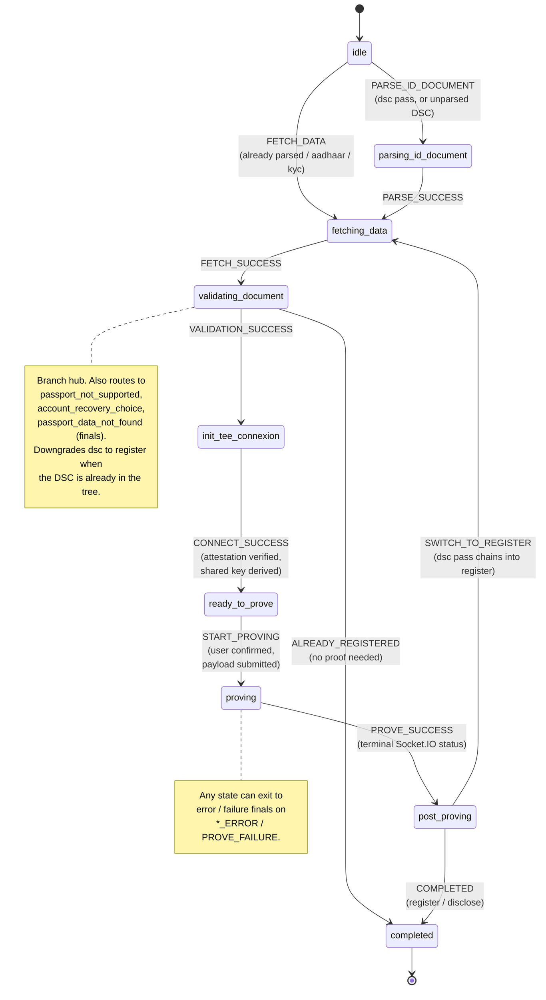
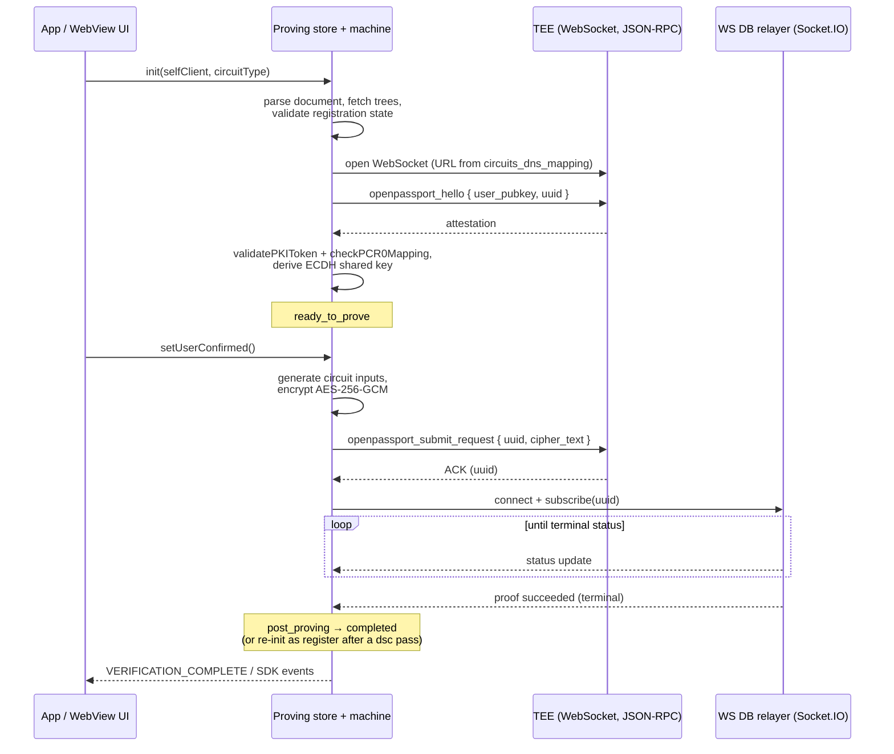
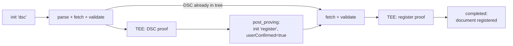

# Proving Flow — Happy Path Reference

> Last updated: 2026-07-08
> Owner: SDK Core
> Project: [SDK Overview](../../OVERVIEW.md)
> Status: Reference (documents current behavior; not a backlog)

Source of truth: [`packages/mobile-sdk-alpha/src/proving/provingMachine.ts`](../../../../../packages/mobile-sdk-alpha/src/proving/provingMachine.ts)

## Scope

Documents the happy path of the proving state machine: the XState machine wrapped in the `useProvingStore` Zustand store that generates zero-knowledge proofs inside a TEE. Error/recovery branches are listed only where they gate the happy path; full error handling is out of scope here.

## Architecture

- **State machine** (`provingMachine`, XState) — owns the legal state transitions only; it has no side effects.
- **Store** (`useProvingStore`, Zustand) — holds connection handles, keys, and document data; `setupActorSubscriptions` watches every transition and fires the async action for the state just entered. Each action's outcome sends the next event, so machine and actions drive each other in lockstep.
- **TEE WebSocket** — JSON-RPC channel to the enclave: `openpassport_hello` (attestation + key exchange), then `openpassport_submit_request` (encrypted circuit inputs).
- **Socket.IO status listener** — second connection to the WS DB relayer, subscribed by UUID, streaming proof progress until a terminal status.

## Circuit types

| Circuit | Purpose | Terminal outcome |
| --- | --- | --- |
| `dsc` | Register the passport's Document Signer Certificate in the DSC tree | Chains into a `register` pass |
| `register` | Register the user's identity commitment | `completed` |
| `disclose` | Prove attributes to a requesting `SelfApp` | `completed` + `handleProofResult(true)` |

A brand-new document runs **two passes** (`dsc` then `register`). If the DSC is already in the tree, `validating_document` downgrades `dsc` → `register` and the flow is a single pass. Disclosure is always a single pass.

## Happy path, in order

1. **`init(selfClient, circuitType, userConfirmed)`** — resets the store, creates and starts the actor, loads the selected document from the keychain and the secret (private key), derives `env` (`prod`, or `stg` for mock documents). Sends `PARSE_ID_DOCUMENT` when DSC parsing is needed (passport/ID card without `dsc_parsed`, or `circuitType === 'dsc'`), otherwise `FETCH_DATA`.
2. **`parsing_id_document`** → `parseIDDocument()` — fetches the SKI-PEM registry, runs `initPassportDataParsing`, re-stores the parsed document in the keychain. → `PARSE_SUCCESS`.
3. **`fetching_data`** → `startFetchingData()` — downloads protocol state for the document category: DSC/CSCA/commitment/OFAC trees, deployed circuits, circuits DNS mapping (passport/ID card via `fetchAllTreesAndCircuits`; aadhaar/KYC via their store `fetch_all`). → `FETCH_SUCCESS`.
4. **`validating_document`** → `validatingDocument()` — the branching hub. On the happy path:
   - `checkDocumentSupported` passes.
   - **disclose:** `isUserRegistered` confirms the commitment is in the tree.
   - **register/dsc:** not already registered, not nullified; if the DSC is already in the DSC tree, circuit type downgrades to `register`.
   - → `VALIDATION_SUCCESS`. (Already registered short-circuits straight to `completed` via `ALREADY_REGISTERED` — no proof, and no `onboarding_completed` analytics thanks to the `didNewRegistrationProof` gate.)
5. **`init_tee_connexion`** → `initTeeConnection()` — resolves the circuit name (`getCircuitNameFromPassportData` or the disclose variants) and its WebSocket URL from `circuits_dns_mapping`, opens the TEE WebSocket. On open, sends `openpassport_hello` with the client pubkey and a fresh UUID. The attestation reply is verified — `validatePKIToken`, PCR0 image-hash mapping (`checkPCR0Mapping`), user-pubkey match — then an ECDH shared key is derived. → `CONNECT_SUCCESS`.
6. **`ready_to_prove`** — waits for user confirmation. `startProving()` runs immediately if `userConfirmed` was passed to `init` (the dsc→register chain does this), otherwise when the UI calls `setUserConfirmed()`. It generates circuit inputs (`_generatePayload` → `generateTEEInputsRegister` / `generateTEEInputsDSC` / `generateTEEInputsDiscloseStateless`), encrypts them AES-256-GCM under the shared key, and sends `openpassport_submit_request`. → `START_PROVING`. (This state auto-reconnects the WebSocket with exponential backoff, max 3 attempts, since the user may idle here.)
7. **`proving`** — the TEE ACKs with the UUID; `_startSocketIOStatusListener` subscribes to that UUID on the WS DB relayer and maps status codes through `handleStatusCode`. Terminal success → `PROVE_SUCCESS`.
8. **`post_proving`** → `postProving()`:
   - `dsc` → after 1.5s, `init(selfClient, 'register', true)` — the machine restarts at step 3 for the register pass.
   - `register` / `disclose` → `COMPLETED`.
9. **`completed`** (final) —
   - `register`: `markCurrentDocumentAsRegistered`, emits `PROVING_ACCOUNT_VERIFIED_SUCCESS`, `PROOF_SUCCEEDED` + `completeOnboardingAttempt` analytics.
   - `disclose`: `handleProofResult(true)` reports back to the requesting app.
   - Both: emits `VERIFICATION_COMPLETE { success: true }`, disables the keychain error modal.

## State diagram

Happy-path states and transitions; error/special-case branches collapsed for legibility.

## TEE session sequence

## Two-pass registration at a glance

## Known quirks

- `listening_for_status` appears in `ProvingStateType` and the disconnect guards but is not a machine state — status listening happens while the machine sits in `proving`.
- `error` is treated as recoverable in onboarding analytics; `failure` (TEE rejected the proof) is not.
- The dsc→register chain re-enters `fetching_data`, not `parsing_id_document`: the document was parsed and re-stored during the dsc pass, so `init` sees `dsc_parsed` and sends `FETCH_DATA`.
