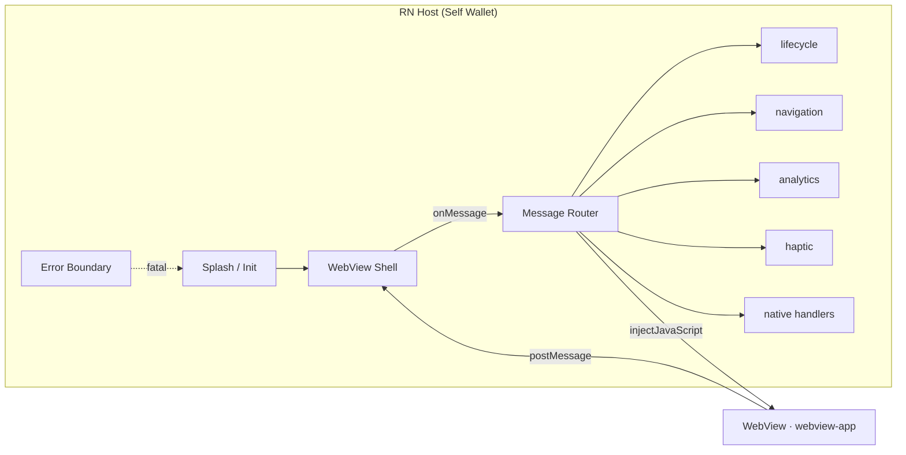
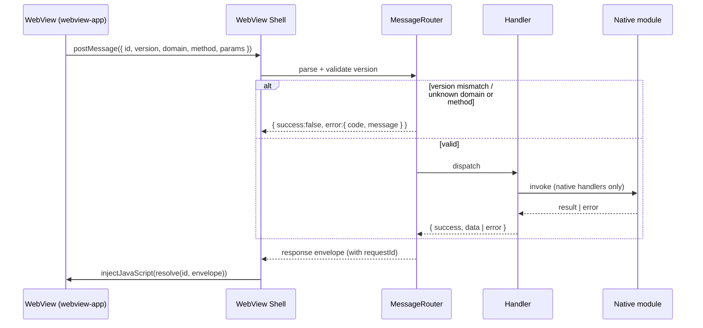

# SPEC — Bridge Host (RN side)

> Last updated: 2026-05-19
> Owner: Self Wallet app team
> Parent: [WebView-in-App](./SPEC.md)
> Status: Active

## Scope

`packages/rn-sdk/` (revived from paused) implements the host side of the
bridge protocol that the WebView already speaks. `app/` consumes it as a
workspace dependency. The JSON contract in `packages/webview-bridge/` is
fixed; this spec defines what runs in the RN-side package to satisfy it.

This spec covers `WIA-02` (host shell + message router) and `WIA-03` (the
no-native handlers: lifecycle, navigation, analytics, haptic).

### In scope

- One WebView screen at the root of the navigation graph. It is the only
  rendered surface in production besides splash and the top-level error
  boundary.
- `onMessage` parsing, schema validation, domain/method dispatch, and
  response envelope synthesis.
- The four no-native handlers: `lifecycle`, `navigation`, `analytics`,
  `haptic`.
- Hardware-back wiring (Android), deep-link and push-notification
  forwarding into the WebView via bridge events.
- Error envelopes for unknown methods, unsupported versions, and handler
  failures.

### Out of scope

- Native handler implementations (`nfc`, `crypto`, `secureStorage`,
  `camera`, `biometrics`, `documents`) — see [SPEC-NATIVE-ADAPTERS.md](./SPEC-NATIVE-ADAPTERS.md).
- Where the bundle URL comes from — see [SPEC-BUNDLE.md](./SPEC-BUNDLE.md).
- Sentry integration inside the WebView — see [SPEC-OBSERVABILITY.md](./SPEC-OBSERVABILITY.md).
- WebView-internal routes and screen logic — `webview/` workstream.

## Architecture



The host shell mounts exactly once per app session. It is not unmounted
across attempts; the WebView decides what to render after a terminal
result.

## Message Lifecycle



## Decisions

1. **The WebView component is owned by `@selfxyz/rn-sdk`.** The package
   imports the bridge transport adapter from `@selfxyz/webview-bridge`
   and wires it to a `react-native-webview` ref. Consumer apps (Self
   Wallet today, 3rd-party RN apps later) mount the exported component
   and pass in only the host-app concerns (splash, error boundary,
   deep-link payload). The shell itself is library code.
2. **One message router, ten domains, no extensions.** The router accepts
   only the domains defined in the current bridge protocol. Unknown domains
   fail closed with `UNKNOWN_DOMAIN`. Adding a domain requires a bridge
   protocol bump, not a host-side patch.
3. **`analytics.trackEvent` over the bridge feeds the existing RN-side
   `_track` pipe in `app/src/services/analytics.ts` verbatim.** Cohort tags
   continue to flow into the RN-host Sentry scope via the existing
   `setOnboardingTags`/`clearOnboardingTags` calls. The bridge handler
   does not re-implement tag logic.
4. **`navigation.goBack` and `navigation.goTo` are WebView-internal.** The
   RN host's React Navigation stack contains splash and the error boundary
   only; there is nowhere for the WebView to navigate to in RN-land.
   Hardware-back maps to a `navigation:back` bridge event the WebView
   consumes; if the WebView signals "no further back", the host treats it
   as an attempt-quit and shows a confirm dialog.
5. **Deep links and push notifications bridge in, not route in.** When the
   RN host receives a deep link (`self://...`) or notification tap, it
   emits a `navigation:deeplink` bridge event with the parsed payload. The
   WebView decides what to do — no URL reload, no host-side route table.
6. **`lifecycle.setResult` is host-observable but not host-acted-upon.**
   The host logs the terminal result and emits a Sentry breadcrumb. The
   WebView is responsible for what renders next (next attempt, home,
   wait state); the host does not pop screens or swap stacks.
7. **`haptic.trigger` calls `react-native-haptic-feedback` directly.** No
   wrapping, no per-platform branching beyond what the library already does.
8. **Bridge protocol version is pinned in the host.** The host declares a
   single supported protocol version constant. The router rejects any
   incoming version that does not match exactly. Cross-version migrations
   bump the constant and the bridge protocol together.

## Error Envelope

Every error path produces the same envelope shape:

```text
{
  success: false,
  requestId: <id from inbound message>,
  error: {
    code: 'UNKNOWN_DOMAIN' | 'UNKNOWN_METHOD' | 'UNSUPPORTED_VERSION'
        | 'INVALID_PARAMS' | 'HANDLER_ERROR' | 'TIMEOUT',
    message: <human-readable, no PII>,
    details: <optional, no PII>
  }
}
```

The bridge protocol's existing error codes are the entire vocabulary.
Handlers do not invent new codes. PII never enters `message` or `details`
— diagnostic context goes to Sentry breadcrumbs via
[SPEC-OBSERVABILITY.md](./SPEC-OBSERVABILITY.md).

## Invariants

1. The host shell does not import from `packages/webview-app/` or
   `packages/mobile-sdk-alpha/`. The only contract between host and
   WebView is the bridge JSON.
2. The message router never throws. Handler failures, schema failures,
   version failures all return error envelopes.
3. No bridge message is processed before the WebView's `lifecycle.ready`
   has been received. Messages received earlier are dropped silently and
   logged as a Sentry breadcrumb.
4. The host emits no analytics events of its own once the WebView is the
   active UI. Anything the host wants tracked goes through the WebView via
   a bridge event the WebView elects to forward.
5. The shell renders a non-interactive fallback (spinner + brand mark) for
   at most 3 seconds while the WebView is loading. After 3s without
   `lifecycle.ready`, the shell shows a recoverable error state and
   captures a Sentry exception.

## Backlog (this topic)

| ID     | Title                                                  | Status  |
| ------ | ------------------------------------------------------ | ------- |
| WIA-02 | RN WebView host shell + message router                 | Pending |
| WIA-03 | Lifecycle, navigation, analytics, haptic handlers      | Pending |

Each ID lands as one PR under `plans/`. Execution detail (file paths,
component layout, library imports) lives in those plans.

## Validation

The shell + router PR ships with end-to-end tests that load a stub HTML
page into the WebView, drive a representative message of each domain
across the bridge, and assert the host's response envelope shape. The
no-native handlers ship with unit tests against the router. Hardware-back
and deep-link wiring is verified on a TestFlight + Play internal build
before the cutover PR (`WIA-11`) merges.
