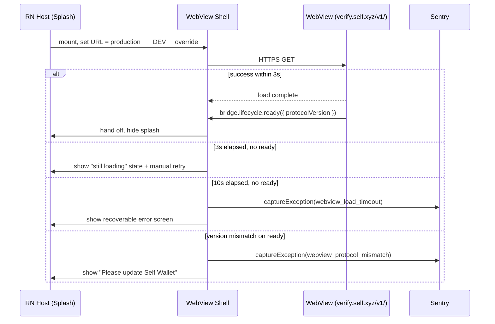

# SPEC — Hosted URL Loading & Versioning

> Last updated: 2026-05-19
> Owner: Release / Build engineer
> Parent: [WebView-in-App](./SPEC.md)
> Status: Active

## Scope

The RN host loads the WebView from a hosted HTTPS URL, matching what
`packages/native-shell-android/` and `packages/native-shell-ios/` do
under the `sdk-distribution/` workstream (SD-01). This spec defines
which URL the host loads, how versioning is pinned across the RN
binary and the WebView schema, how dev overrides are gated, and what
the host does when the load fails.

This spec covers `WIA-09`.

### In scope

- The production URL contract.
- The coupling between the RN binary version and the WebView protocol
  version it supports.
- The dev-server override pattern.
- Offline / first-launch behavior.
- Loading-latency UX (splash → ready handoff).
- Sentry instrumentation for load failures.

### Out of scope

- Hosting infrastructure for `verify.self.xyz` — owned by
  `sdk-distribution/`. This spec consumes the URL; it does not specify
  the CDN, TLS, or caching policy.
- The bundle build pipeline that produces the artifact behind that URL
  — owned by `build-pipeline/` (BP-01, done).
- The bridge protocol itself — owned by `packages/webview-bridge/`.
  Version handshake belongs to it; this spec defers to it.
- Embedded-bundle fallback. Considered as a follow-up under "Known
  Gaps"; not part of v1.

## Decisions

1. **Production URL: `https://verify.self.xyz/v1/`.** Identical to
   what the native shells load. The RN host is one more consumer of
   the same hosted target.
2. **Major version in the URL path is a breaking-schema bump.** A
   change to the bridge protocol or to the host-contract surface that
   would crash a v1 host moves the WebView to `/v2/`. The hosting team
   keeps `/v1/` alive long enough for old RN binaries to upgrade.
3. **The RN host pins its supported schema version as a build
   constant.** Set in a `webviewSchemaVersion` constant at app build
   time, included in the URL the host loads. The constant is bumped
   by the engineer cutting a release, never at runtime.
4. **Dev override via `WEBVIEW_DEV_URL` env var, gated on `__DEV__`
   only.** Release builds ignore the variable entirely. The host
   asserts at startup that any non-production URL is rejected outside
   `__DEV__` and fails closed (recoverable error screen).
5. **No embedded fallback bundle in v1.** Offline first-launch shows
   a recoverable error with a retry button and a "check your
   connection" message. Subsequent launches rely on the WebView's
   standard browser cache. Embedded fallback is a follow-up if
   retention metrics show offline-first-launch friction.
6. **Loading UX is splash + spinner up to 3 seconds.** Past 3s the
   splash transitions to a "still loading" state with a manual retry
   button. Past 10s without `lifecycle.ready`, the host captures a
   Sentry exception (`webview_load_timeout`) and shows the error
   screen. The 3s / 10s thresholds match the bridge host's invariant
   on `lifecycle.ready` timing in
   [SPEC-BRIDGE-HOST.md](./SPEC-BRIDGE-HOST.md).
7. **No OTA / cohort-routing mechanism in v1.** Updates to the
   WebView are deployed by the hosting team to `verify.self.xyz/v1/`.
   Cache-busting on deploy is the hosting team's problem (hashed
   asset URLs at the index level).
8. **Version mismatch fails closed.** If the host loads a WebView
   whose handshake advertises a protocol version the host does not
   support, the host shows a "Please update Self Wallet" error and
   captures a Sentry exception. The host does not attempt a
   best-effort downgrade.

## Loading Sequence

## Invariants

1. Production builds load only `https://verify.self.xyz/<version>/`.
   The allowlist is enforced at build time, not runtime — release
   binaries do not contain the code path that reads
   `WEBVIEW_DEV_URL`.
2. The host emits a Sentry breadcrumb at every state transition in
   the loading sequence (load start, load complete, ready, timeout,
   mismatch). These breadcrumbs are present on every captured
   exception, regardless of which state surfaced it.
3. The host has no logic that depends on the WebView's internal
   route table. The URL pointed at the host is an opaque entry point.
4. Network failures during initial load are user-actionable (visible
   retry), not silently retried in the background.
5. The Sentry exception captured on timeout / mismatch carries the
   `runtime: rn-host` tag and a `webview_target_url` tag with the
   sanitized URL (host + path; no query string).

## Known Gaps

- **Offline subsequent launches.** Standard WebView cache covers most
  users, but the cache is not under our control. If a follow-up
  uncovers offline-first-launch friction in retention metrics, revive
  BP-02 (build-pipeline) and ship an embedded fallback at next-RN-
  release cadence.
- **Cohort-targeted WebView builds.** If A/B testing the WebView is
  required (e.g., a redesigned settings flow rolled out to 10% of
  users), a manifest layer routing different cohorts to different
  WebView URLs is the eventual answer. Not part of v1; flag if the
  webview team needs it.
- **CDN/origin outage.** If `verify.self.xyz` goes hard down, every
  Self Wallet install is bricked. Mitigation lives in
  `sdk-distribution/` (multi-region hosting, status page).

## Backlog (this topic)

| ID     | Title                                  | Status  |
| ------ | -------------------------------------- | ------- |
| WIA-09 | Hosted URL loading + version pinning   | Pending |

`WIA-09`'s PR adds the schema-version build constant, the
`WEBVIEW_DEV_URL` env wiring (gated on `__DEV__`), the loading-state
machine in the WebView shell, the Sentry breadcrumb hooks, and the
two error screens (timeout, version mismatch).

## Cross-Workstream Coordination

- **`sdk-distribution/`** owns `verify.self.xyz` hosting; coordinate
  any URL change or deprecation timeline with that workstream's
  owner before the RN host pins to a new version.
- **`build-pipeline/`** owns the artifact behind the URL. BP-02
  (embedded bundle) stays deferred unless an offline-fallback gap
  surfaces.
- **`webview/`** workstream owns the WebView's protocol-version
  declaration on `lifecycle.ready`. Coordinate version bumps so the
  host and the WebView do not deploy mismatched majors.

## Validation

- Production build, no internet on first launch → error screen with
  retry; no crash; Sentry breadcrumb chain present on the captured
  exception.
- Production build, normal launch → splash hides within 3 seconds on
  a typical 4G connection from a regression test device.
- Dev build with `WEBVIEW_DEV_URL=http://localhost:5173` → loads
  localhost; banner indicates dev mode.
- Production build with `WEBVIEW_DEV_URL=http://anything` → variable
  is ignored, production URL loads, no error (because the dev code
  path is compiled out).
- Synthetic version mismatch (host pinned to v1, WebView handshake
  declares v2) → "Please update Self Wallet" screen, Sentry exception
  captured.
