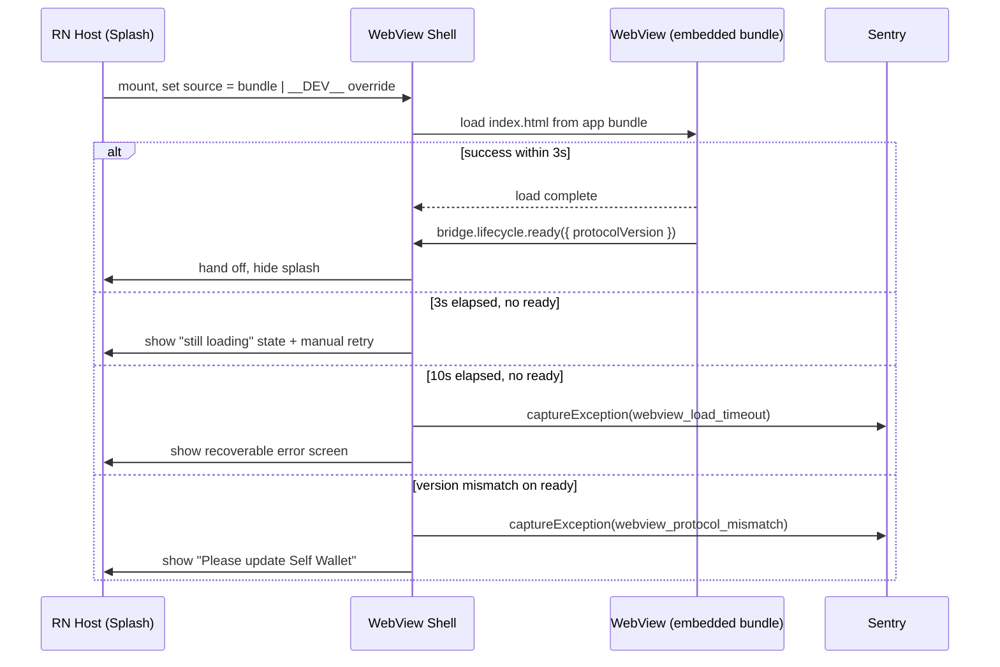

# SPEC — Bundle Loading & Versioning

> Last updated: 2026-05-19
> Owner: Release / Build engineer
> Parent: [WebView-in-App](./SPEC.md)
> Status: Active

## Scope

The RN host loads the WebView from an **embedded bundle** at app
install time. The build-pipeline (BP-01, done) copies the latest
`@selfxyz/webview-app` dist into `packages/rn-sdk/assets/self-wallet/`,
which gets bundled into the host's iOS .ipa / Android .apk. This
matches what `packages/native-shell-android/` and
`packages/native-shell-ios/` currently do, and is consistent with the
existing rn-sdk-test-app integration.

Hosted HTTPS URL loading from `verify.self.xyz` is a future
evolution under the `sdk-distribution/` workstream; it is not the v1
mechanism for Self Wallet because (a) embedded bundles avoid
offline-first-launch friction, (b) HTTPS introduces a single point of
failure if the CDN goes down, and (c) WebView caches across hosted
deploys are out of our control.

This spec covers `WIA-09`.

### In scope

- The production URL contract.
- The coupling between the RN binary version and the WebView protocol
  version it supports.
- The dev-server override pattern.
- Offline / first-launch behavior.
- Loading-latency UX (splash → ready handoff).
- Sentry instrumentation for load failures.

### Out of scope

- Hosting infrastructure for `verify.self.xyz` — owned by
  `sdk-distribution/`. This spec consumes the URL; it does not specify
  the CDN, TLS, or caching policy.
- The bundle build pipeline that produces the artifact behind that URL
  — owned by `build-pipeline/` (BP-01, done).
- The bridge protocol itself — owned by `packages/webview-bridge/`.
  Version handshake belongs to it; this spec defers to it.
- Embedded-bundle fallback. Considered as a follow-up under "Known
  Gaps"; not part of v1.

## Decisions

1. **The WebView loads from an embedded bundle.** Android:
   `file:///android_asset/self-wallet/index.html`. iOS:
   `${RNFS.MainBundlePath}/self-wallet/index.html` (or relative path
   fallback). The bundle is produced by `@selfxyz/webview-app` build
   and copied into `packages/rn-sdk/assets/self-wallet/` by the
   build-pipeline (BP-01, done).
2. **Each Self Wallet release is paired with a webview-app build.** The
   bundle is frozen at app build time. Updating the WebView requires
   shipping a new RN binary release — no OTA. The app-version
   constant in the RN host's release notes carries the
   webview-app commit it was built against.
3. **`devServerUrl` is the only override, and it is `__DEV__`-gated.**
   Production builds compile the dev path out entirely. Engineers
   working locally pass `devServerUrl="http://localhost:5173"` (or
   their dev box's IP); release binaries ignore the prop.
4. **Loading UX is splash + spinner up to 3 seconds.** Past 3s the
   splash transitions to a "still loading" state. Past 10s without
   `lifecycle.ready`, the host shows a recoverable error with a
   retry button. The 3s / 10s thresholds match the bridge host's
   invariant in [SPEC-BRIDGE-HOST.md](./SPEC-BRIDGE-HOST.md).
5. **Version mismatch fails closed.** If the bundled WebView's
   handshake advertises a protocol version the host does not
   support, the host shows a "Please update Self Wallet" error and
   captures a Sentry exception. The host does not attempt a
   best-effort downgrade.
6. **Hosted URL loading is a future evolution, not v1.** When and if
   we want OTA-style updates without app store cycles, the
   `sdk-distribution/` workstream wires `verify.self.xyz/v1/` as an
   alternative source. The bridge protocol and the host shell stay
   identical; only the `source` prop on the WebView changes. This
   spec does not block on that evolution.

## Loading Sequence

## Invariants

1. Production builds load only the embedded bundle. The
   `devServerUrl` prop is gated on `__DEV__` and compiled out of
   release builds entirely — a malicious or accidental prop in
   production has no effect.
2. The host emits a Sentry breadcrumb at every state transition in
   the loading sequence (mount, load complete, ready, timeout,
   mismatch). These breadcrumbs are present on every captured
   exception, regardless of which state surfaced it.
3. The host has no logic that depends on the WebView's internal
   route table. The bundle is an opaque entry point.
4. First-launch failures (corrupt bundle, asset-bundling
   misconfiguration) surface as user-actionable errors with a retry,
   not silent crashes.
5. The Sentry exception captured on timeout / mismatch carries the
   `runtime: rn-host` tag and a `webview_source` tag identifying
   bundle vs dev-server source.

## Known Gaps

- **WebView updates require app-store cycles.** With the embedded
  bundle model, a UI-only WebView change ships only when a new RN
  binary is released. If iteration speed becomes a constraint, the
  hosted-URL evolution (Decision 6) is the answer.
- **Cohort-targeted WebView builds.** A/B testing the WebView in v1
  requires shipping multiple RN binaries (per-cohort builds), which
  is impractical. Defer to the hosted-URL evolution when this becomes
  a real need.
- **Bundle size.** The embedded WebView bundle adds to the app's
  install size. If install-size pressure becomes a concern, the
  hosted-URL evolution shrinks the binary at the cost of a network
  dependency on first launch.

## Backlog (this topic)

| ID     | Title                                  | Status  |
| ------ | -------------------------------------- | ------- |
| WIA-09 | Bundle loading + version pinning       | Pending |

`WIA-09`'s PR adds the loading-state machine in the WebView shell,
the `__DEV__`-gated `devServerUrl` prop, the Sentry breadcrumb hooks,
and the two error screens (timeout, version mismatch). The
embedded-asset paths and the build-pipeline copy step already exist
from BP-01 and the rn-sdk-test-app integration.

## Cross-Workstream Coordination

- **`build-pipeline/`** owns the bundle artifact under
  `packages/rn-sdk/assets/self-wallet/` (BP-01, done). Any change
  to the bundle layout requires coordinated updates in this spec.
- **`sdk-distribution/`** owns the future hosted-URL evolution
  (Decision 6). Not active in v1.
- **`webview/`** workstream owns the WebView's protocol-version
  declaration on `lifecycle.ready`. Coordinate version bumps so the
  host and the bundle do not ship mismatched majors.

## Validation

- Production build, airplane mode → bundle loads fine (no network
  dependency); splash hides within 3s on a regression test device.
- Production build with a corrupted asset folder → error screen with
  retry; no crash; Sentry breadcrumb chain present on the captured
  exception.
- Dev build with `devServerUrl="http://localhost:5173"` → loads
  localhost. Stop the dev server → "still loading" state at 3s,
  error at 10s, retry restores load.
- Synthetic `devServerUrl` in a release build → prop ignored, embedded
  bundle loads (because the dev code path is compiled out).
- Synthetic version mismatch (host pinned to v1, WebView handshake
  declares v2) → "Please update Self Wallet" screen, Sentry exception
  captured.
