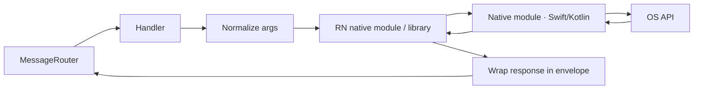

# SPEC — Native Adapters

> Last updated: 2026-05-19
> Owner: iOS + Android native engineers
> Parent: [WebView-in-App](./SPEC.md)
> Status: Active

## Scope

The RN app already owns the hardware: NFC, MRZ optical capture, QR
scanning, keychain, biometric prompts, and a document database. None of
those modules speak the bridge protocol today; they ship bespoke
signatures with positional args (iOS) or option objects (Android) and
return raw promises rather than the bridge's success/error envelope.

This spec defines how each bridge domain that requires a native
capability is wired in the RN host. It covers `WIA-04` (secureStorage),
`WIA-05` (crypto), `WIA-06` (nfc), `WIA-07` (camera/MRZ), `WIA-08`
(biometrics), and `WIA-15` (documents).

### In scope

- Mapping each bridge domain to the RN-side native module or RN library
  that satisfies it.
- The signature, response, and error normalizations each handler must
  perform.
- Per-platform notes where the iOS and Android RN modules differ.
- The single new native module required (crypto) — its key type,
  signing algorithm, and key storage location.

### Out of scope

- The router that dispatches inbound messages to these handlers — see
  [SPEC-BRIDGE-HOST.md](./SPEC-BRIDGE-HOST.md).
- The bundle / URL the WebView loads from — see
  [SPEC-BUNDLE.md](./SPEC-BUNDLE.md).
- Sentry integration on either side — see
  [SPEC-OBSERVABILITY.md](./SPEC-OBSERVABILITY.md).
- New bridge domains or protocol changes. The 10 existing domains are
  fixed; this spec only wires their handlers.

## Handler Map

| Bridge domain   | Backed by (RN side)                            | Wrapper effort      |
| --------------- | ---------------------------------------------- | ------------------- |
| `secureStorage` | `react-native-keychain` (SecureEnclave/Keystore)| Thin                |
| `crypto`        | **New** RN native module (AndroidKeyStore + iOS Security framework) | New module          |
| `nfc`           | `RNPassportReader` (Android) + `PassportReader` (iOS) via `react-native-passport-reader` | Normalize signatures + events |
| `camera`        | Existing `MRZScannerModule` (iOS) + Android counterpart | Normalize + lifecycle |
| `biometrics`    | `react-native-biometrics` (or equivalent — settled in plan) | Thin                |
| `documents`     | Existing `databaseProvider` + keychain split   | Delegate            |

`haptic`, `analytics`, `lifecycle`, and `navigation` do not require
native code and are covered in [SPEC-BRIDGE-HOST.md](./SPEC-BRIDGE-HOST.md).

## Architecture

Handlers translate, they do not re-implement. The OS-level work
already exists in the RN modules; the handler is a normalization
layer that the bridge router can call uniformly.

## Decisions

1. **One new native module, named `SelfCrypto`, lives in
   `packages/rn-sdk/`.** No existing RN module exposes key generation
   + ECDSA signing with the algorithm choices the bridge protocol
   requires. `react-native-keychain` does not cover it. The new
   module is a thin wrapper over AndroidKeyStore (Kotlin, in
   `packages/rn-sdk/android/`) and the iOS Security framework
   (Swift, in `packages/rn-sdk/ios/`), autolinked into any RN host
   that depends on `@selfxyz/rn-sdk`. Other handlers wrap existing
   libraries; this is the only net-new native code in the workstream.
2. **Crypto algorithm matches the Kotlin/Swift shells exactly.**
   EC/secp256r1 keys, SHA256withECDSA signatures. Same algorithm
   identifiers as `packages/native-shell-android/` and
   `packages/native-shell-ios/`. WebView code is agnostic to which
   shell runs underneath; algorithm parity is what guarantees that.
3. **Keychain stays native-managed.** `secureStorage` delegates to
   `react-native-keychain`, which binds SecureEnclave/Keystore. No
   JS-side fallback path is permitted in the handler.
4. **NFC handler reshapes RNPassportReader's signature.** Android's
   `RNPassportReader.scan({options})` accepts an options object; iOS's
   `PassportReader.scanPassport(passportNumber, dateOfBirth, ...)`
   accepts positional args. The handler accepts the bridge's
   `{ params: Record<string, unknown> }` shape and dispatches per
   platform. The bridge protocol does not learn about positional args.
5. **NFC progress events route through the bridge events channel, not
   custom callbacks.** Scan progress (`reading dg1`, `chip authenticated`,
   etc.) emits bridge events on a `nfc:progress` channel. The WebView
   subscribes via `bridge.on('nfc', 'progress', handler)`. No
   per-handler callback registration.
6. **Documents handler delegates, doesn't own.** Sensitive payloads
   (passport, Aadhaar) continue to be keychain-backed in the existing
   `databaseProvider` flow; catalog metadata continues to live in the
   existing TS-side database. The handler is a thin re-export of the
   existing operations; it does not re-design the storage layer.
7. **Every handler returns the bridge error vocabulary.** Native
   errors are mapped to one of `INVALID_PARAMS`, `HANDLER_ERROR`,
   `TIMEOUT`, or the domain-specific codes already defined in the
   bridge protocol. Raw RN error objects never reach the WebView. PII
   never enters `error.message` or `error.details` — diagnostic
   payload goes to a Sentry breadcrumb (see
   [SPEC-OBSERVABILITY.md](./SPEC-OBSERVABILITY.md)).
8. **Per-platform forks are confined to handlers.** A handler may
   branch on `Platform.OS` to call the right RN module API. The
   bridge protocol and the router do not see platform.
9. **No handler holds long-lived state.** NFC scan state, camera
   session state, biometric prompt state all live inside the RN module
   the handler wraps. Re-entry is the WebView's responsibility (one
   in-flight scan at a time; the WebView gates concurrent requests).

## Per-Handler Notes

- **`secureStorage`** wraps three `react-native-keychain` operations
  (`setGenericPassword`, `getGenericPassword`, `resetGenericPassword`).
  Keys are namespaced with a `self.` prefix to avoid collision with
  any RN-app-level keychain usage that survives cutover.
- **`crypto`** ships with the new `SelfCrypto` native module. Keys
  generated by `crypto.generateKey` are stored in the hardware-backed
  keystore. The public key returned by `crypto.getPublicKey` is the
  uncompressed SEC1 form (matches the Kotlin/Swift shells). The
  signature returned by `crypto.sign` is DER-encoded ECDSA over the
  SHA-256 of the input bytes.
- **`nfc`** distinguishes a `scan` from a `cancelScan`. `cancelScan`
  is idempotent and never errors if no scan is in flight. `isSupported`
  returns the union of "the hardware exists" and "the OS gave us NFC
  permission".
- **`camera`** owns lifecycle (`scanMRZ` opens the capture session,
  closes on success or cancel). Background → foreground transitions
  while a scan is in flight cancel the scan; the handler returns a
  `HANDLER_ERROR` with code `SCAN_INTERRUPTED`.
- **`biometrics`** maps `authenticate` to a prompt with a one-shot
  result. `getBiometryType` returns one of `FaceID | TouchID |
  Fingerprint | None`. `isAvailable` returns the OS capability, not
  user enrollment status — enrollment is implicit in `authenticate`'s
  failure modes.
- **`documents`** maps the five bridge methods (`loadCatalog`,
  `saveCatalog`, `loadById`, `save`, `delete`) to the existing
  database operations. Sensitive document payloads remain keychain-
  backed via the existing `databaseProvider` flow.

## Invariants

1. No business logic in Swift or Kotlin. New native code in
   `SelfCrypto` contains only OS-API calls and serialization — no
   parsing, validation, or decision logic.
2. Handlers do not import from `packages/webview-app/` or call back
   into the WebView except via the bridge response envelope.
3. The signature, response, and error shape exposed to the bridge are
   identical to what `native-shell-android/` and `native-shell-ios/`
   expose. A handler that drifts breaks the "WebView does not know
   which shell it runs inside" invariant.
4. Argument normalization is one-way. The handler accepts the bridge's
   shape and translates to the RN module's shape; it does not expose
   the RN module's shape back to the WebView.
5. NFC scan progress payloads carry no PII. The chip data goes back in
   the final `scan` response; in-flight events carry only stage names.

## Backlog (this topic)

| ID     | Title                                              | Status  |
| ------ | -------------------------------------------------- | ------- |
| WIA-04 | `secureStorage` handler — wrap react-native-keychain | Pending |
| WIA-05 | `crypto` handler — new `SelfCrypto` native module    | Pending |
| WIA-06 | `nfc` handler — normalize RNPassportReader signatures| Pending |
| WIA-07 | `camera` handler — MRZ scan session                  | Pending |
| WIA-08 | `biometrics` handler                                 | Pending |
| WIA-15 | `documents` handler — delegate to databaseProvider   | Pending |

`WIA-04` should land first as a warm-up (smallest surface, all
existing infrastructure). `WIA-05` is the largest single piece of work
because of the new native module; do not bundle it with another
handler. Remaining handlers (`WIA-06` to `WIA-08`, `WIA-15`) are
independent and can run in parallel.

## Known Gaps

These are not in this spec's scope but will need to be resolved before
cutover (`WIA-11`):

- **Cloud backup.** The RN app's `CloudBackupScreen` triggers iCloud
  (iOS) / Google Drive (Android) flows. None of the 10 bridge domains
  cover this. Options: extend `secureStorage` with backup methods, or
  add a new bridge domain (which violates the umbrella's "no new
  domains" out-of-scope). Settle in an addendum spec or in
  `WIA-04`'s plan, whichever the implementer prefers.
- **Push notification token registration.** Today the RN app handles
  APNs / FCM registration directly. The WebView needs to know about
  taps (handled in `SPEC-BRIDGE-HOST.md` as deep-link bridging) but
  not necessarily about token lifecycle. Confirm whether token
  registration needs a bridge surface or can stay RN-only.

## Validation

Each handler's PR ships with unit tests against a mocked RN module
plus an integration test driving the handler from a stub message
router. Real-hardware tests for `nfc`, `camera`, `biometrics`, and
`crypto` run on a TestFlight + Play internal build before the cutover
PR (`WIA-11`) merges. `secureStorage` and `documents` are covered by
the existing RN test infrastructure (no real-hardware path).
