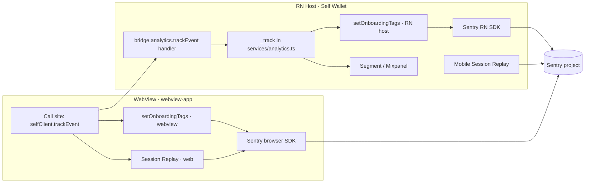

# SPEC — Observability (webview-in-app)

> Last updated: 2026-05-19
> Owner: Analytics / Product Observability
> Parent: [WebView-in-App](./SPEC.md)
> Status: Active

## Scope

ANA-13 established a Sentry-first observability surface in the RN app:
breadcrumbs replace ~80% of Mixpanel events, a cohort-tag taxonomy stamps
every captured event, Session Replay with PII masking covers the
onboarding screens, and a `beforeSend` redact list strips biometric
property names. ANA-13 explicitly carved the WebView out of scope.

This spec carries the same surface into the WebView so that cutover
(`WIA-11`) does not regress observability. It covers `WIA-12` (WebView
Sentry integration), `WIA-13` (WebView Session Replay), and `WIA-14`
(re-homing ANA-15's `attempt_id` footer onto webview-app screens).

### In scope

- Sentry browser SDK initialization inside `webview-app`.
- Cohort-tag continuity: same key set, same source mappings, same
  sanitization, same terminal-event clear semantics as ANA-13.
- PII masking inside the WebView DOM: equivalents to the RN-side
  `PrivacyMask` wrappers on biometric capture / NFC / data-confirmation /
  Aadhaar / KYC-verified screens.
- Session Replay configuration in the browser SDK matching the RN
  baseline (`maskAllText`, `maskAllImages`, `maskAllVectors`).
- `beforeSend` redact list parity with ANA-13.
- ANA-15's `attempt_id` footer ported to the webview-app screens that
  replace `KycFailureScreen`, `DocumentNFCTroubleScreen`,
  `ProofRequestStatusScreen` (failure variant), and
  `AadhaarUploadErrorScreen`.
- Migration of the cohort-tag mapping module from
  `app/src/observability/` into `packages/mobile-sdk-alpha/` so both
  runtimes import from one source of truth.

### Out of scope

- Forking the Sentry project. Both runtimes ship to the same project; a
  `runtime` tag (`rn-host` | `webview`) distinguishes origin.
- Re-architecting the analytics pipeline. Mixpanel/Segment delivery
  stays single-sourced through the RN host's `_track` pipe per
  [SPEC-BRIDGE-HOST.md](./SPEC-BRIDGE-HOST.md) Decision 3.
- Performance/tracing instrumentation. Out for both runtimes per ANA-13.
- Tag taxonomy changes. The ANA-13 set is canonical; additions require
  an `analytics/` workstream spec, not a webview-in-app PR.

## Architecture

The single Sentry project receives events from both runtimes. Cohort
tags are set on both sides from the same shared mapping module; events
correlate by `attempt_id`.

## Decisions

1. **One Sentry project, two SDKs.** The WebView runs `@sentry/browser`
   with the same DSN as the RN host's `@sentry/react-native`. A
   `runtime` tag (`rn-host` | `webview`) is set at SDK init on each
   side and is never cleared.
2. **Mixpanel/Segment stay RN-host-only.** The WebView's
   `AnalyticsAdapter` routes every `trackEvent` call over the bridge.
   The bridge handler calls the existing `_track` pipe verbatim. The
   WebView does not bundle Segment or Mixpanel.
3. **Cohort tags are set on both sides, from one mapping module.** The
   `OnboardingTagSnapshot` type, `tagsFromAnalyticsEvent` mapping, and
   `setOnboardingTags`/`clearOnboardingTags` setters move from
   `app/src/observability/onboardingContext.ts` to
   `packages/mobile-sdk-alpha/`. The RN host and the WebView each
   import the mapping and wire it to their respective Sentry SDK. Tag
   keys, mappings, sanitization, and the terminal-event clear list
   (`Onboarding: Completed | Failed | Recovered`) are identical on
   both sides.
4. **PII redact list and `beforeSend` are duplicated, not shared.** The
   redact regex (`passport|mrz|dg\d|chip|aadhaar|name|dob|birth|photo`)
   is defined as a constant exported from `packages/mobile-sdk-alpha/`
   and each side wires it into its own `beforeSend`. The reason for
   duplicating the wiring (but not the constant) is that browser and
   RN Sentry SDKs expose `beforeSend` differently.
5. **WebView Session Replay matches RN baseline.** `maskAllText: true`,
   `maskAllInputs: true`, replay sample rate matches the RN
   configuration (10% session, 100% on error). DOM nodes carrying
   biometric content opt in to additional masking via a
   `data-sentry-mask` attribute on the wrapper element. The list of
   wrapper sites mirrors the RN PrivacyMask list (biometric capture,
   NFC scan, data confirmation, Aadhaar upload, KYC verified).
6. **Cross-runtime correlation is by `attempt_id`.** Engineers search
   Sentry by `attempt_id:<uuid>` to pull every event (RN host + WebView)
   for one attempt. No second correlation key is introduced.
7. **No cross-bridge exception forwarding.** A JS error inside the
   WebView is captured by `@sentry/browser` directly; it is not
   serialized over the bridge to the RN host. The shared project +
   cohort tag taxonomy is enough to keep the forensic trail joined.
8. **ANA-15's footer ports to webview-app, ANA-15 itself does not ship
   against RN.** Per the umbrella's Cross-Workstream Dependencies
   note, ANA-15 is re-homed under `WIA-14`. The shared
   `getCurrentAttemptId()` accessor in `mobile-sdk-alpha` (added by
   ANA-15) is consumed; the React Native component is rewritten as a
   webview-app component using Euclid tokens.

## Invariants

1. Every captured Sentry event carries `runtime` and (if an attempt is
   active) the full ANA-13 cohort tag set. Missing `runtime` or
   missing `attempt_id` on an in-flight attempt is a bug.
2. The mapping from event payload key to tag key has exactly one
   definition in the repo. Adding a new tag requires editing that
   module and is observable to both runtimes simultaneously.
3. PII never enters a Sentry tag. Tag values pass through
   `sanitizeTagValue` on both sides. The redact regex applied in
   `beforeSend` matches on both sides.
4. Cohort tags clear on `Onboarding: Completed | Failed | Recovered`
   on both sides. A long-lived session that completes one attempt and
   starts another does not leak tags from the prior attempt.
5. The WebView's `AnalyticsAdapter` has no path to Mixpanel/Segment
   when the WebView runs inside the RN host. The only telemetry the
   WebView ships directly is Sentry (browser SDK).
6. Session Replay does not record screens between the WebView's
   `lifecycle.ready` and the first attempt-bootstrapping event unless
   `maskAllText`/`maskAllInputs` are on. The default is always-on
   masking; the WebView never disables it.

## Backlog (this topic)

| ID     | Title                                                            | Status  |
| ------ | ---------------------------------------------------------------- | ------- |
| WIA-12 | WebView Sentry browser SDK + cohort tags + redact list           | Pending |
| WIA-13 | WebView Session Replay (web SDK) with mask wrappers              | Pending |
| WIA-14 | Re-home ANA-15 `attempt_id` footer onto webview-app error screens| Pending |

Migration of the cohort-tag mapping module into `mobile-sdk-alpha`
ships with `WIA-12` (not a separate plan); the RN-side import path
update is part of the same PR so there is no window where the two
sides diverge.

## Cross-Workstream Coordination

- **`analytics/` workstream.** Owns the ANA-13 taxonomy; any addition or
  rename here requires a coordinated PR on both sides. Ping that
  workstream's owner before changing tag keys, the redact regex, or
  the terminal-event clear list.
- **`webview/` workstream.** Owns the screens that host the ANA-15
  footer. `WIA-14` lands as a webview-app PR; the
  `AttemptReference`-equivalent component lives in `webview-app/src/`
  (Euclid tokens, not RN typography).

## Validation

- Trigger a synthetic error inside the WebView on a TestFlight build.
  Confirm Sentry captures it with all expected cohort tags + the
  `runtime: webview` tag. The captured event is reachable by
  `attempt_id:<uuid>` and groups with RN-host events from the same
  attempt.
- Force `Onboarding: Failed` and confirm cohort tags clear on both
  sides. Start a new attempt in the same session; confirm no leakage
  from the prior attempt.
- Open Session Replay for a captured biometric-flow error. Confirm
  text and image content in the biometric-capture / NFC scan / data
  confirmation regions are fully masked.
- Tap the `attempt_id` footer on a webview-app error screen; confirm
  it copies the same uuid that Sentry's `attempt_id` tag carries for
  the captured event.
